# THAItern × IDEAX · App Flow (Frontend → Backend)

> **หนึ่งเครื่องยนต์ สองประตู** — ประตูเปิด **THAItern** ให้ผู้เรียนทั่วประเทศทำโจทย์จริงของ SMEs และชุมชน
> ประตูมหาวิทยาลัย **IDEAX** ให้อาจารย์ใช้เคสจากคลังเดียวกันในรายวิชา และเห็นกระบวนการคิดกับ AI ของนักศึกษา
> ทั้งสองประตูใช้ Learning Engine, คลังโจทย์, Decision Trace และระบบ Evidence ชุดเดียวกัน

**แหล่งที่มาของเอกสารนี้**

| แหล่ง | ใช้เป็นฐานของ |
|---|---|
| รายงาน *Atikarn Startup Project 2026 – THAItern* (ก.ย. 2569) บทที่ 3 | เส้นทางผู้ใช้ 14 ขั้น, Decision Trace, 7-Stage, Sawtooth, 2 Track, ฟีเจอร์, สถาปัตยกรรม (ตาราง 14–20) |
| รายงานฯ บทที่ 2 และ 5 | ลำดับ Productive Failure, แนวคิด IDEAX, การผสานสองประตู, ลำดับการพัฒนา (ตาราง 39) |
| รายงานฯ บทที่ 4 | แหล่งรายได้ (ตาราง 33), ข้อเสนอแนะกรรมการ/Panel, ประเด็นข้อมูลที่ไม่สอดคล้อง (ตาราง 37) |
| รายงานฯ ภาคผนวก ข, ค | ความยินยอมผู้เรียน/ผู้ปกครอง, สัญญาอนุญาตใช้ข้อมูลกับ SME |
| `IDEAX-3Gate-mockup.html` (6 ก.ย. 2569) | หน้าจอ IDEAX ฝั่งอาจารย์ นักศึกษา องค์กร, state machine การตรวจ, กฎ AC-xx |

ข้อความที่เป็น **ข้อเสนอของเอกสารนี้** (ไม่ได้มาจากแผนหรือ mockup) จะกำกับด้วย 💡

---

## สารบัญ

1. [ภาพรวม: หนึ่งเครื่องยนต์ สองประตู](#1-ภาพรวม-หนึ่งเครื่องยนต์-สองประตู)
2. [ผู้ใช้ บทบาท และพอร์ทัล](#2-ผู้ใช้-บทบาท-และพอร์ทัล)
3. [สถาปัตยกรรมระบบ](#3-สถาปัตยกรรมระบบ)
4. [Tech stack](#4-tech-stack)
5. [Flow 0 · สมัคร ยืนยันตัวตน และความยินยอม](#5-flow-0--สมัคร-ยืนยันตัวตน-และความยินยอม)
6. [Flow 1 · ผลิตเคสกับ SME / ชุมชน](#6-flow-1--ผลิตเคสกับ-sme--ชุมชน)
7. [Flow 2 · เส้นทางผู้เรียน THAItern 14 ขั้น](#7-flow-2--เส้นทางผู้เรียน-thaitern-14-ขั้น)
8. [Flow 3 · ประเมินผล Feedback และ Certificate](#8-flow-3--ประเมินผล-feedback-และ-certificate)
9. [Flow 4 · ห้องเรียน IDEAX](#9-flow-4--ห้องเรียน-ideax)
10. [Flow 5 · Portfolio เผยแพร่ และองค์กร](#10-flow-5--portfolio-เผยแพร่-และองค์กร)
11. [Flow 6 · Mentoring และการชำระเงิน](#11-flow-6--mentoring-และการชำระเงิน)
12. [State machines](#12-state-machines)
13. [Decision Trace: รูปแบบข้อมูล](#13-decision-trace-รูปแบบข้อมูล)
14. [Data model](#14-data-model)
15. [Frontend route map](#15-frontend-route-map)
16. [API contract](#16-api-contract)
17. [กฎที่ระบบต้อง enforce](#17-กฎที่ระบบต้อง-enforce)
18. [KPI และ analytics events](#18-kpi-และ-analytics-events)
19. [ตาราง mockup action → API](#19-ตาราง-mockup-action--api)
20. [ประเด็นที่ต้องตัดสินใจก่อนสร้าง](#20-ประเด็นที่ต้องตัดสินใจก่อนสร้าง)
21. [ลำดับการพัฒนา](#21-ลำดับการพัฒนา)

---

## 1. ภาพรวม: หนึ่งเครื่องยนต์ สองประตู

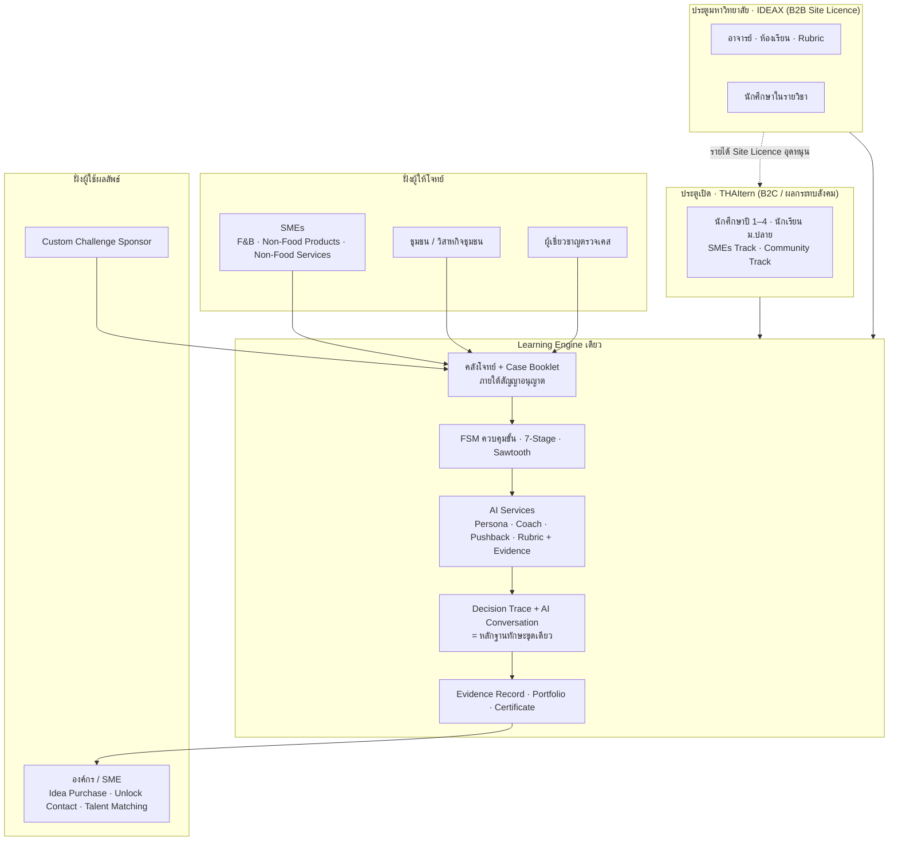

**หลักการออกแบบที่ทุก flow ต้องถือ** (จากรายงานบทที่ 3, 5 และ mockup)

1. **AI ถาม ไม่ทำแทน** — AI Coach แบบ Socratic ให้ feedback แต่ไม่เฉลย, Pre-submission Reviewer ไม่ใช่ผู้ตัดสินสุดท้าย
2. **มนุษย์ตัดสินสุดท้าย** — SME, ผู้เชี่ยวชาญ, กรรมการ, อาจารย์ ตรวจทานผลจาก AI ผ่าน dashboard
3. **ทุกผลประเมินมีหลักฐาน** — AI ประเมินเป็นระดับ (Categorical Banding) พร้อมประโยคหลักฐาน (Evidence Quote) ไม่ใช่คะแนนดิบ
4. **ไม่จัดอันดับ ไม่มุ่งตัดเกรด** — Decision Trace บันทึกสิ่งที่เลือกทำและเหตุผล เพื่อสร้าง Evidence Record
5. **ข้อมูล SME เป็นความลับ** — ปลดล็อกด้วยรหัส, อ่านบนเว็บเท่านั้น, ลายน้ำชื่อผู้ใช้, ถอดเคสได้ตามสัญญา
6. **ความยินยอมแยกตามวัตถุประสงค์** — การใช้ AI กับ Decision Trace, Talent Matching, ผู้ปกครองของผู้เยาว์ แยกกันและถอนได้
7. **สีมีความหมาย** — ฟ้า = AI เสนอ · เขียว = มนุษย์ยืนยัน · เทาเส้นประ = ข้อมูลไม่พอ (mockup)

---

## 2. ผู้ใช้ บทบาท และพอร์ทัล

| พอร์ทัล | บทบาท (`role`) | ใคร | ทำอะไร |
|---|---|---|---|
| **Learner App** (mobile-first) | `learner` | นักศึกษาปี 1–4 (หลัก), นักเรียน ม.4–6 (รอง) | สมัคร, สร้างทีม ≤ 4 คน, ทำเคส 14 ขั้น, รับ feedback, Portfolio |
|  | `guardian` | ผู้ปกครองของผู้เยาว์ | ยืนยันความยินยอมผ่าน OTP |
| **Instructor Workspace** (IDEAX) | `instructor` / `thesis_mentor` | อาจารย์ | สร้างห้องเรียน, แจกงาน + rubric, ตรวจ, ปล่อย feedback, ดูกลุ่มความเข้าใจ |
|  | `assistant_marker` | ผู้ช่วยตรวจ | ตรวจได้ ปล่อยผลไม่ได้ 💡 |
| **Partner Portal** | `case_owner` | เจ้าของ SME / ตัวแทนชุมชน | ส่งข้อมูล, อนุมัติ Case Booklet, อ่านผลงานที่ผ่านคัดกรอง, ให้ feedback, SME's Choice, ขอถอดเคส |
|  | `org_member` / `org_admin` | องค์กรที่ต้องการไอเดีย/บุคลากร | ค้นผลงานที่เผยแพร่, Shortlist, ขอซื้อไอเดีย, ปลดล็อกข้อมูลติดต่อ, Custom Challenge |
| **Mentor & Review Console** | `mentor` | พี่เลี้ยง / ผู้เชี่ยวชาญ | Office Hour, ตอบ Q&A ภายใน 72 ชม., รับค่าตอบแทน |
|  | `case_reviewer` | ผู้เชี่ยวชาญตรวจเคส | ตรวจทุกเคสก่อนเผยแพร่ ระบุชื่อผู้ตรวจ |
|  | `judge` | กรรมการ | ตรวจผลงานร่วมกับ SME |
| **Ops Console** | `case_ops`, `platform_admin` | ทีมงาน | ผลิตเคส, ปกปิดข้อมูล, จัดรอบ, ดู audit/diagnostics, จัดการคำขอตามสิทธิเจ้าของข้อมูล |

**เขตข้อมูล 3 เขต** แยกกันในระดับ schema และ service

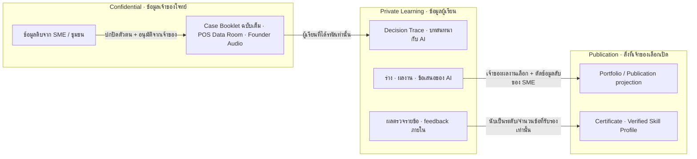

---

## 3. สถาปัตยกรรมระบบ

ตามตาราง 20 ของรายงาน (ส่วนหน้า · ตัวตนและความยินยอม · Learning Engine · บริการ AI · ข้อมูล · มนุษย์ในวงจร) ขยายเป็น module ได้ดังนี้

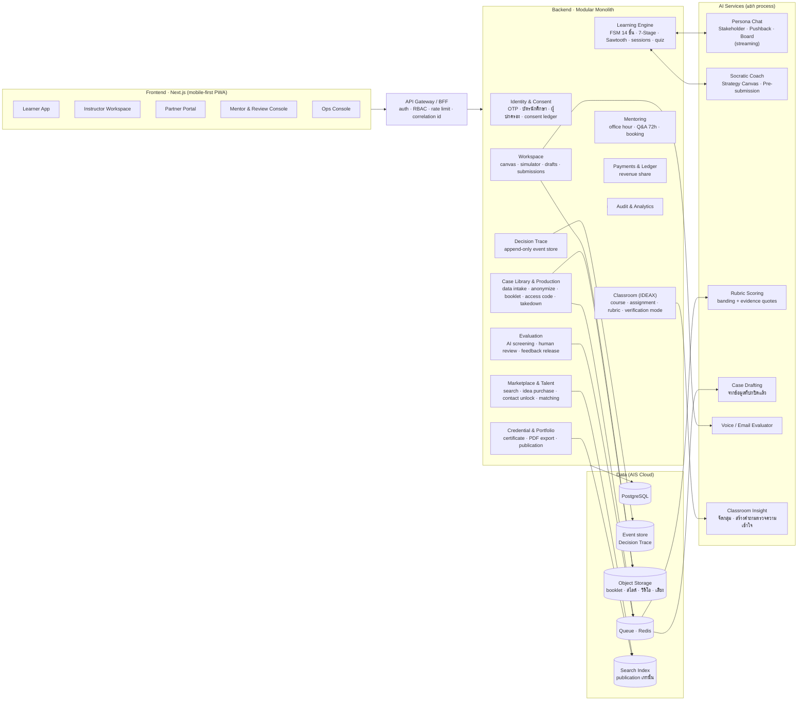

**เหตุผลหลัก**

- **FSM อยู่ที่ server** (Rule-based Control Flow ตามรายงาน) — ฝั่ง frontend แค่แสดงสถานะ ห้ามตัดสินว่าผ่านขั้นหรือไม่
- **AI แยก process** — persona chat ต้อง streaming และงาน scoring ช้า/ล่มได้ แต่การส่งงานต้องไม่ล่มตาม (AC-01)
- **Decision Trace เป็น event store แบบ append-only** — เป็นทั้งหลักฐานทักษะ, audit, และแหล่งข้อมูล KPI
- **Search index รับเฉพาะ publication** — ข้อมูล Confidential และ Private ไม่มีทางไปถึงองค์กร (AC-06)

---

## 4. Tech stack

| ชั้น | เลือก | เหตุผล |
|---|---|---|
| Frontend | Next.js (App Router) + TypeScript, PWA, TanStack Query, Zod | ต้นแบบเดิมอยู่บน Vercel (`thaitern.vercel.app`), กลุ่มเป้าหมายใช้มือถือ/แท็บเล็ตเป็นหลัก |
| UI tokens | จาก mockup: `--proposed`, `--verified`, `--attention`, brand navy/blue/teal/green, ฟอนต์ Anuphan | กฎสีเป็นกฎข้อมูล |
| Backend | Fastify (TypeScript) modular monolith — โค้ดจริงใช้ Fastify แทน NestJS ที่เสนอไว้เดิม เพราะเบาและทดสอบผ่าน `inject` ได้เร็ว | แชร์ schema กับ frontend (`packages/contracts`), แยก module ตาม Gate |
| State machine | XState หรือ FSM table ใน DB + guard ฝั่ง server | ตามรายงาน: FSM + Server-side Logic Engine ตรวจ Data Schema และล็อกสถานะ |
| DB | PostgreSQL บน AIS Cloud | ตามแผนการเงิน (15,000 บาท/เดือน) |
| Event store | ตาราง `trace_event` append-only (Postgres) ในระยะแรก | ย้ายไป stream แยกเมื่อขยาย 💡 |
| Queue | Redis + BullMQ (ตอนนี้ใช้ queue ในโปรเซสที่มี interface เดียวกัน) | retry งาน AI |
| AI | LLM ผ่าน provider abstraction, **ระบุโมเดลตามงาน** (รายงานใช้ Gemini ในต้นแบบ และคิดต้นทุนเคสจาก Qwen3.6-35B-A3B บน DeepInfra) | ตาราง 37 ข้อ "โมเดล AI" ให้ระบุตามงานให้ชัด, ใช้บริบท ไม่ fine-tune ด้วยข้อมูล SME |
| Streaming | Server-Sent Events จาก AI service ผ่าน BFF | persona โต้แย้งแบบเรียลไทม์ (ขั้น 7–8, Stage 7) |
| Storage | S3-compatible | booklet, สไลด์, วิดีโอ, คลิปเสียง; booklet ไม่เปิด URL ตรง |
| Identity | OIDC + AIS Open API (Mobile Number Verification / OTP) + ตรวจบัตรนักศึกษา | ยืนยันตัวตน + ความยินยอมผู้ปกครอง |
| Search | Meilisearch / OpenSearch | index publication เท่านั้น |
| Payment | Payment gateway ไทย (PromptPay/บัตร) 💡 | Mentor slot, Idea purchase, Contact unlock |

---

## 5. Flow 0 · สมัคร ยืนยันตัวตน และความยินยอม

เป้าหมาย **Time to Value < 60 วินาที** (ตาราง 23) — ต้องไม่ขวางผู้ใช้จนถึง action แรก แต่ต้องครบก่อนเห็นข้อมูลลับ

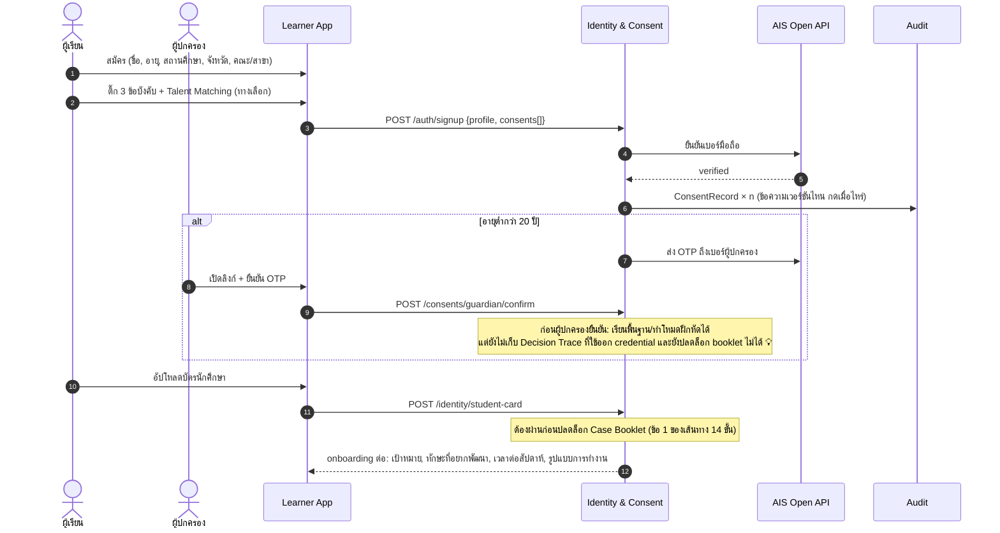

**ความยินยอม (ภาคผนวก ข)**

| รหัส | ข้อ | บังคับ | ถอนได้ | ผลเมื่อถอน |
|---|---|---|---|---|
| `tos` | ข้อกำหนดการใช้งาน | ✓ | ปิดบัญชี | – |
| `confidentiality` | รักษาความลับข้อมูล SME / Case Booklet | ✓ | ปิดบัญชี | – |
| `pdpa_ai` | ข้อมูลส่วนบุคคล + ประมวลผล Decision Trace ด้วย AI | ✓ | ตามสิทธิ PDPA | หยุดประมวลผลใหม่, ออก credential ใหม่ไม่ได้ |
| `talent_matching` | ใช้ข้อมูลจับคู่ฝึกงาน/งาน | ทางเลือก | ✓ | ถอดจาก matching และ search ของ Talent ทันที |
| `guardian` | ความยินยอมผู้ปกครอง (ผู้เยาว์) | ตามอายุ | ✓ | กลับไปสถานะโหมดฝึกหัด |

ทุก consent เก็บเป็น `consent_record` (ผู้ใช้, รหัส, เวอร์ชันข้อความ, การกระทำ, เวลา, ช่องทาง) แบบ append-only และมีหน้า **คำขอตามสิทธิเจ้าของข้อมูล** (เข้าถึง, สำเนา, แก้ไข, ลบ, ทำให้ไม่ระบุตัว, ระงับ, คัดค้าน, ถอน) ส่งเข้า Ops Console

---

## 6. Flow 1 · ผลิตเคสกับ SME / ชุมชน

อิงภาคผนวก ค (บันทึกข้อตกลงอนุญาตให้ใช้ข้อมูล) และคำตอบกรรมการ (ตาราง 32): สรรหาผ่าน Impvest, ทำสัญญา, ปกปิดตัวตน, เจ้าของอนุมัติก่อนเผยแพร่, ขอถอดเคสได้, ผู้เชี่ยวชาญตรวจทุกเคส

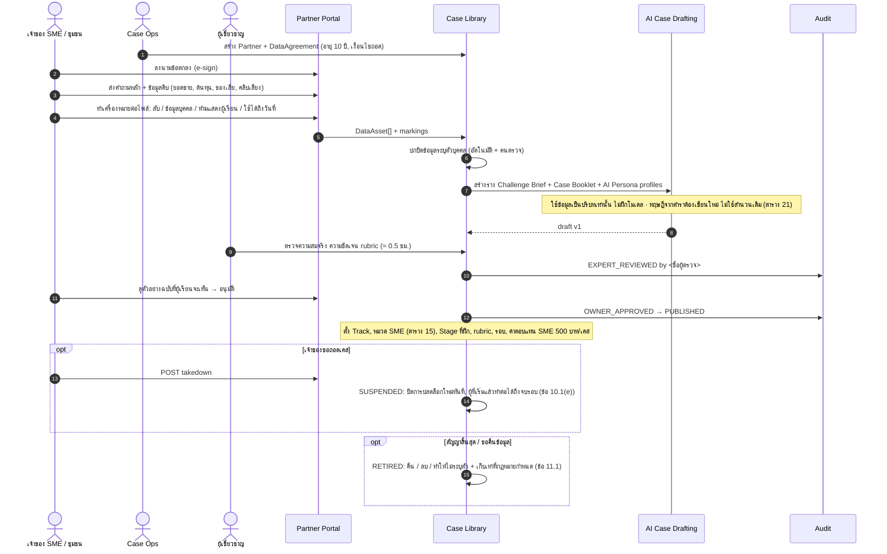

**Case package ที่ผลิตออกมา** (ใช้ได้ทั้งสองประตู)

| ส่วน | ใช้ในขั้น | เปิดเมื่อ |
|---|---|---|
| Teaser (ธุรกิจ/ชุมชน, บริบท, อัตลักษณ์ — ไม่บอกปัญหา) | 3 | ตอนเลือก |
| Challenge Brief (ปัญหาย่อที่ไม่ลับ) | 4 (Productive Failure) | หลังเลือก 1 แห่ง |
| Case Booklet ฉบับเต็ม | 5–12 | ได้รหัส (เริ่มนับ 14 วัน) |
| Founder Audio Briefing + บทถอดความ | 6 | ได้รหัส |
| POS Data Room (สเปรดชีต) | 6–9 | ได้รหัส, อ่านบนเว็บ |
| Persona profiles (HR, Ops, Marketing, เจ้าของ, ชาวชุมชน) | 6, 8, 11 | ได้รหัส |
| Financial model parameters | 9 | ได้รหัส |
| Rubric + คำถามของ SME ที่ต้องตอบ | 7, 12, 13 | ได้รหัส |

---

## 7. Flow 2 · เส้นทางผู้เรียน THAItern 14 ขั้น

### 7.1 ลำดับขั้นหลังปรับตาม Productive Failure

รายงานบทที่ 2 และ 5 เสนอให้ปรับจาก "เรียนครบก่อนเห็นโจทย์" เป็น **เห็นโจทย์ → ร่างคำตอบแรก 30 นาที → เรียน → แก้ร่าง → ส่งงาน** เอกสารนี้จึงแทรกขั้น **4a ร่างแรก** และใช้ Challenge Brief ที่ไม่ลับแทนการเปิด booklet ก่อนเวลา (ดูข้อ 20 เรื่องที่ต้องยืนยัน)

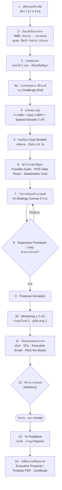

### 7.2 ขั้น → หน้าจอ → API → ข้อมูล

| ขั้น | หน้าจอ (Learner App) | API หลัก | ข้อมูล / Trace event | Guard (server) |
|---|---|---|---|---|
| 1 | `/signup`, `/teams/new` | `POST /teams`, `POST /teams/:id/invites` | `team.created`, `member.joined` | ทุกคนในทีมยืนยันบัตรนักศึกษาก่อนปลดล็อก |
| 2 | `/explore` | `GET /catalog/filters?track=` | `interest.selected` | – |
| 3 | `/explore/recommendations` | `GET /catalog/recommendations`, `POST /attempts {caseId}` | `case.chosen` | เลือกได้ 1 แห่งต่อรอบ, ไม่แสดงปัญหา |
| 4a | `/attempts/:id/first-draft` | `GET …/brief`, `PUT …/drafts/first` (timer 30 นาที) | `draft.first.saved` | ร่างนี้ใช้เป็น baseline วัดผล ไม่ถูกประเมิน |
| 4 | `/attempts/:id/learn/:session` | `GET /sessions/:id`, `POST /quizzes/:id/attempts` | `session.completed`, `quiz.scored` | ทุกเซสชันจบ + quiz ≥ 80% |
| 5 | `/attempts/:id/unlock` | `POST /attempts/:id/unlock {code}` | `booklet.unlocked` (`deadline = +14 วัน`) | รหัสผูกกับผู้ใช้/ทีม, consent ครบ |
| 6 | `/attempts/:id/case`, `/data-room`, `/chat/:persona` | `GET /booklets/:id/pages` (render ฝั่ง server + ลายน้ำ), `POST /persona-chats/:id/messages` (SSE) | `booklet.viewed`, `data.inspected`, `persona.asked` | อ่านบนเว็บเท่านั้น, ตรวจการใช้งานผิดปกติ |
| 7 | `/attempts/:id/canvas` | `PUT /canvas/:id/sections/:key`, `POST /canvas/:id/coach` | `canvas.section.saved`, `coach.hint.shown` | coach ห้ามเขียนแทน (output filter) |
| 8 | `/attempts/:id/pushback` | `POST /pushback/:id/rounds` (SSE) | `pushback.challenged`, `pushback.defended`, `pushback.passed` | ต้องผ่านก่อนเข้าขั้น 9 |
| 9 | `/attempts/:id/simulator` | `POST /simulations/:id/runs {price, marketing, headcount}` | `simulation.run` | – |
| 10 | `/attempts/:id/mentoring` | `GET /mentor-slots`, `POST /bookings`, `POST /qna` | `mentoring.attended`, `qna.asked` | ≥ 2 ครั้ง (เจ้าของโจทย์ 1 + ผู้เชี่ยวชาญ 1) |
| 11 | `/attempts/:id/deliverables` | `POST /uploads` (สไลด์/วิดีโอ), `POST /email-drafts/:id/evaluate`, `POST /pitches` (เสียง 2 นาที) | `deliverable.uploaded`, `email.scored`, `pitch.scored` | – |
| 12 | `/attempts/:id/precheck` | `POST /attempts/:id/precheck` | `precheck.run` | advisory เท่านั้น ไม่มีเปอร์เซ็นต์ความพร้อม |
| ส่ง | `/attempts/:id/submit` | `POST /attempts/:id/submissions` (Idempotency-Key) | `submission.received` | ก่อน deadline, ครบทุกไฟล์ที่ rubric ต้องการ |
| 13 | `/attempts/:id/feedback` | `GET /submissions/:id/feedback` | `feedback.viewed` | เห็นเฉพาะที่ release แล้ว (AC-12) |
| 14 | `/portfolio` | `POST /portfolio/exports`, `GET /certificates/:id` | `portfolio.exported`, `certificate.issued` | ต้องผ่านคำถามตรวจความเข้าใจ (ข้อ 9.4) ก่อนออก certificate |

### 7.3 Sawtooth Support และ 7-Stage

แต่ละเคสฝึกหนึ่งหรือหลาย Stage (ตาราง 13) ระดับความช่วยเหลือขึ้นกับประวัติของผู้เรียนใน Stage นั้น

| Stage | ทักษะ | ตัวอย่างกิจกรรม | ขั้นใน 14 ขั้นที่วัด |
|---|---|---|---|
| 1 | Problem Structuring | Issue Tree, 5 Whys | 4a, 7 (Problem) |
| 2 | Hypothesis | สมมติฐาน 2–3 ข้อ + ข้อมูลพิสูจน์ | 7 |
| 3 | Data Analysis | Insight จากยอดขาย/ต้นทุนจริง | 6 (Data Room), 7 (Unit Economics) |
| 4 | Stakeholder Insight | สัมภาษณ์ AI Persona | 6 (Stakeholder Chat) |
| 5 | Option Evaluation | Impact / Feasibility / Risk | 7 (Risks), 8 |
| 6 | Financial Reasoning | Financial Simulator | 9 |
| 7 | Communication under Pressure | นำเสนอต่อ AI เจ้าของกิจการที่โต้แย้ง | 11 (Pitch the Board) |

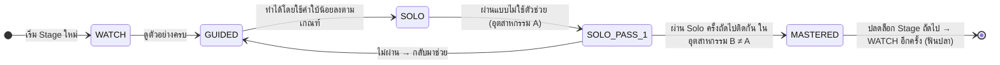

**กฎผ่าน Stage** (รายงานหน้า 24, 28): Solo pass 2 ครั้ง **ติดต่อกัน** ใน **2 อุตสาหกรรมที่ต่างกัน** — enforce ใน `StageProgressService` ด้วยข้อมูลจาก trace event ไม่ใช่จาก client

ระดับความช่วยเหลือที่ UI แสดง (ตาราง 6 ของรายงาน):

| ระดับ | สิ่งที่แสดง |
|---|---|
| `WATCH` | ตัวอย่างละเอียด, template เต็ม, walkthrough |
| `GUIDED` | คำใบ้, AI เตือนเมื่อขาดหลักฐาน, template บางส่วน |
| `SOLO` | ไม่มีคำใบ้ (fading), ใช้ตัวช่วยได้แต่ถูกบันทึกว่าไม่ใช่ Solo |

### 7.4 AI ในขั้น 6–12 ทำอะไร ไม่ทำอะไร

| เครื่องมือ | AI ทำ | AI ไม่ทำ |
|---|---|---|
| Stakeholder Chat | สวมบทฝ่าย HR / Ops / Marketing / ชาวชุมชน ตอบจากข้อมูลในเคสเท่านั้น | เดาข้อมูลที่ไม่มีในเคส (ตอบว่า "ไม่ทราบ") |
| AI Strategy Canvas | ถามกลับ, ชี้ส่วนที่ขาดหลักฐาน, แสดงระดับคุณภาพพร้อมเหตุผล | เขียนเนื้อหาให้ |
| Supervisor Pushback | สวมบท Senior Consultant โต้แย้งสมมติฐาน | ให้ผ่านโดยไม่ได้ตอบข้อโต้แย้ง |
| Financial Simulator | คำนวณผลจากพารามิเตอร์เคส | – (deterministic ไม่ใช้ LLM) 💡 |
| Executive Email / Pitch the Board | ประเมินโครงสร้าง คำศัพท์ การนำเสนอ | ให้คะแนนดิบที่ calibrate ไม่ได้ (ใช้ระดับ + หลักฐาน) |
| Pre-submission Reviewer | ตรวจความครบถ้วนและเหตุผล | ตัดสินผลทางการ |

---

## 8. Flow 3 · ประเมินผล Feedback และ Certificate

ตัดสิน 2 ชั้น (รายงานหน้า 26–27): **AI ประเมินตาม rubric พร้อมยกประโยคหลักฐาน → SME อ่านเฉพาะผลงานที่ผ่านการคัดกรอง** ทุกทีมได้ feedback

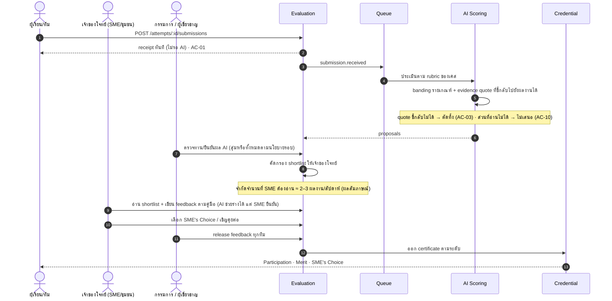

- ทีมที่ไม่ผ่านคัดกรองยังได้ **feedback จากกรรมการ/ผู้เชี่ยวชาญ** ที่ต่อยอดจากข้อเสนอของ AI แต่ต้องมีมนุษย์ยืนยันก่อน release (AC-12)
- Community Track ตัดสินโดย **ตัวแทนชุมชนจริง** ทีมโดดเด่นได้รับเชิญคุยกับผู้นำชุมชน หน่วยงานรัฐ หรือผู้สนับสนุน
- Certificate ออกได้เมื่อ (1) มีผลที่ release แล้ว และ (2) ผ่านคำถามตรวจความเข้าใจจากงานของตัวเอง (จุดเชื่อม IDEAX ในรายงานหน้า 51)

---

## 9. Flow 4 · ห้องเรียน IDEAX

ประตูมหาวิทยาลัยใช้ engine เดียวกัน แต่เจ้าของรอบคืออาจารย์ หน้าจอส่วนนี้มีต้นแบบครบใน `IDEAX-3Gate-mockup.html`

### 9.1 สิ่งที่ IDEAX เพิ่มจาก THAItern (รายงานหน้า 51)

| ความสามารถ | รายละเอียด |
|---|---|
| Classroom | อาจารย์สร้างห้อง เพิ่มนักศึกษา แจกการบ้าน / Use Case (หรือเคสจากคลัง THAItern) พร้อม rubric และสิ่งที่ต้องการให้เรียนรู้ |
| AI ภายในแพลตฟอร์ม | นักศึกษาใช้ AI ในแพลตฟอร์มเท่านั้น ระบบเห็นว่าถามอะไร ได้อะไร ถามต่อ/แก้อย่างไร |
| Socratic AI | ถามกลับ: "ทำไมจึงเลือกคำตอบนี้" "ข้อมูลอะไรสนับสนุน" "ถ้าเงื่อนไขเปลี่ยนจะตัดสินใจอย่างไร" |
| วิเคราะห์ 3 มิติเมื่อส่งงาน | คุณภาพงาน · คุณภาพการใช้ AI (Prompt & Idea) · ระดับความเข้าใจ |
| คำถามตรวจความเข้าใจ | สร้างจากงานของนักศึกษาเอง ให้อธิบายอีกครั้ง |
| Verification mode | จำกัด copy-paste, จำกัดการออกจากหน้าจอ, คำถามปลายเปิดเชิงรุก — เพื่อให้กลับมาคิด ไม่ใช่จับผิด |
| จัดกลุ่มให้อาจารย์ | เข้าใจดี · งานดีแต่ยังอธิบายไม่ได้ · ควรได้ feedback เพิ่ม · หลักฐานยังไม่พอ + To-do ทั้งสองฝั่ง |
| Verified Skill Profile | หลักฐานพัฒนาการสะสม ต่อยอดเป็นโปรไฟล์ที่องค์กรเชื่อถือได้ |

### 9.2 ส่งงาน → วิเคราะห์ → อาจารย์ตรวจ → ปล่อยผล

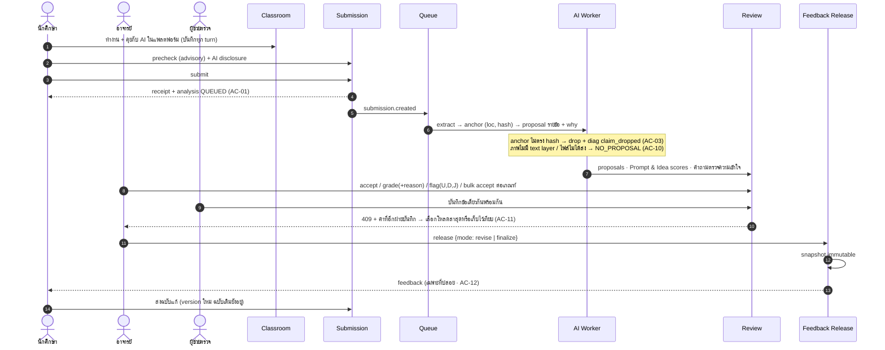

### 9.3 Verification mode

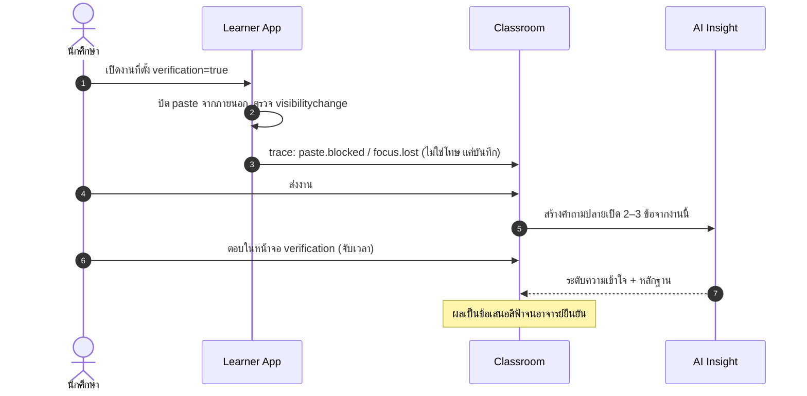

### 9.4 กลุ่มความเข้าใจ (Insight)

`GET /courses/:id/insights` คืน 4 กลุ่มพร้อมเหตุผลและ to-do โดยทุกการจัดกลุ่มต้องชี้ไปยังหลักฐาน (งาน, บทสนทนา, คำตอบ verification) ถ้าไม่มีหลักฐานพอให้อยู่กลุ่ม **หลักฐานยังไม่พอ** ไม่เดา

### 9.5 จุดเชื่อมสองประตู (รายงานหน้า 51)

| จุดเชื่อม | การ implement |
|---|---|
| คลังโจทย์ภายใต้สัญญาเดิม | `Assignment.case_id` อ้าง `Case` เดียวกัน, สิทธิ์การใช้ในรายวิชาเป็น field ใน `DataAgreement` |
| Decision Trace + บทสนทนากับ AI = หลักฐานทักษะเดียว | ทั้งสองลงตาราง `trace_event` เดียว ต่างกันที่ `context` (`attempt` / `assignment`) |
| อาจารย์ต่างจังหวัดเป็นพี่เลี้ยงผ่าน Dashboard | `instructor` ที่ opt-in ได้ role `mentor` ในประตูเปิด |
| คำถามตรวจความเข้าใจก่อนออก Certificate | `CertificateService.issue` guard: ต้องมี `verification.passed` ของ attempt นั้น |

---

## 10. Flow 5 · Portfolio เผยแพร่ และองค์กร

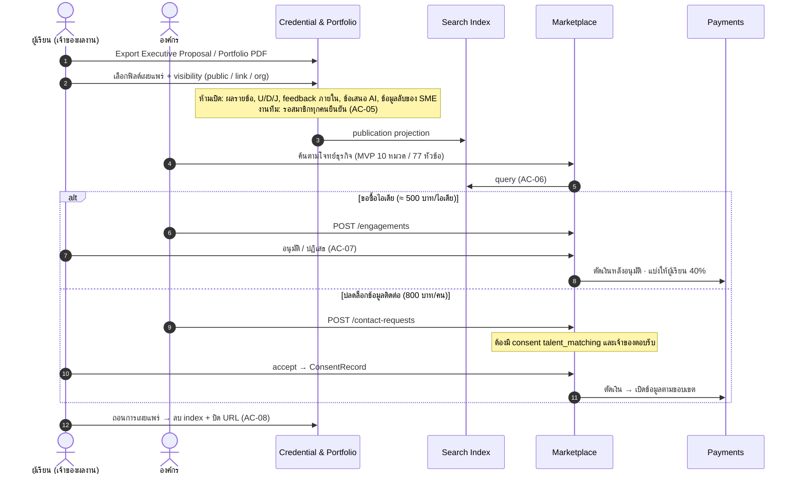

**Custom Challenge Sponsorship** (35,000 บาท/เดือน/ราย) — องค์กรกลายเป็น `case_owner` ของเคสเฉพาะ ใช้ Flow 1 เหมือน SME และเห็นผลงานของเคสตัวเองผ่าน Partner Portal

---

## 11. Flow 6 · Mentoring และการชำระเงิน

| รูปแบบ | รายละเอียด (ตาราง 32–33) | ระบบ |
|---|---|---|
| Office Hour แบบกลุ่ม | ขั้น 10 ขั้นต่ำ 2 ครั้ง | `MentorSlot(type=group)`, จองผ่าน `POST /bookings` |
| Q&A แบบพิมพ์ | ตอบภายใน 72 ชั่วโมง | `QnaThread` + SLA timer + แจ้งเตือนพี่เลี้ยง |
| Extra Mentor Slot | 350 บาท/ครั้ง, จ่ายพี่เลี้ยง 70% | `Order` → `Payment` → `LedgerEntry` (platform 30%, mentor 70%) |
| ค่าตอบแทน SME | 500 บาท/เคส, แนะนำคิดรายชั่วโมงถ้าเป็นพี่เลี้ยง | `Payout` ต่อ `Case` |

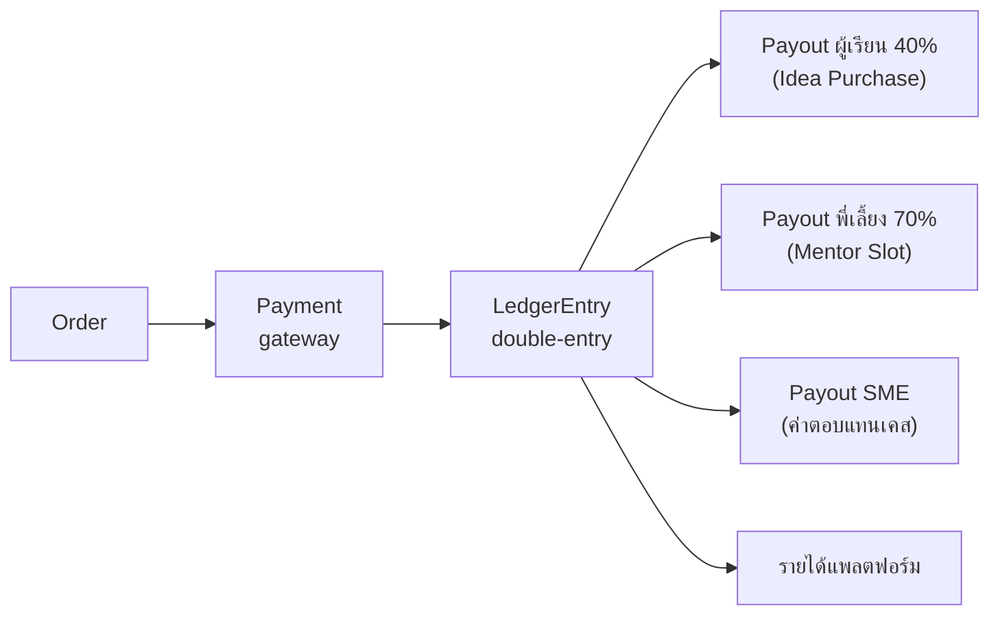

---

## 12. State machines

ทุก transition ผ่าน service method เดียวที่เขียน `audit_log` และ `trace_event` ใน transaction เดียวกัน

### Case (คลังโจทย์)

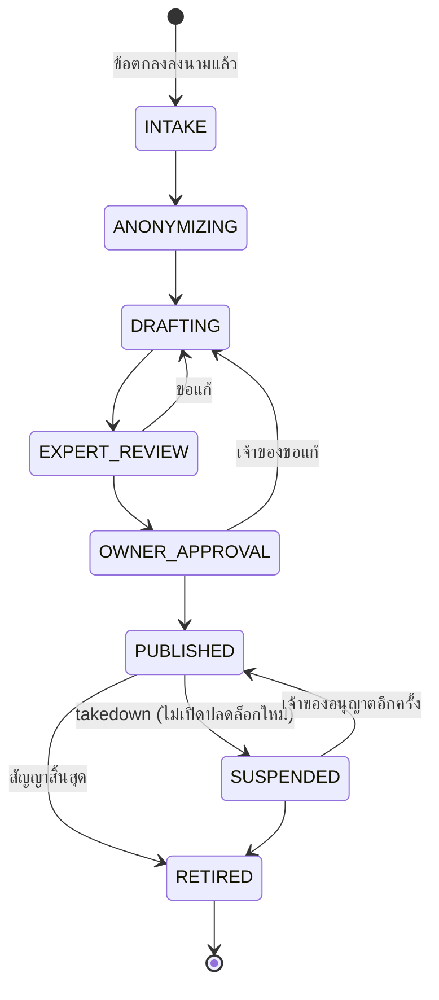

### CaseAttempt (เส้นทาง 14 ขั้นของทีมหนึ่งกับเคสหนึ่ง)

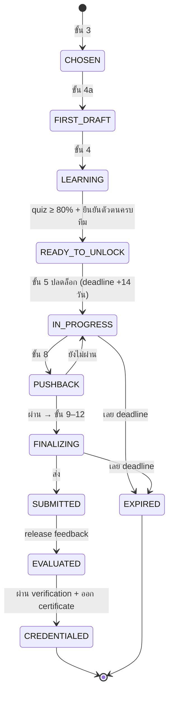

### Submission / AnalysisRun / ReviewItem (จาก mockup IDEAX)

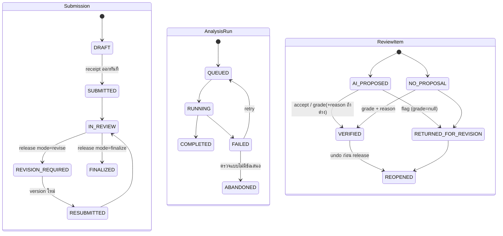

### Publication / ContactRequest / Engagement / Consent

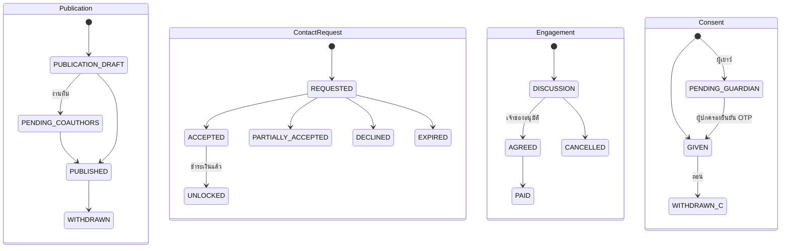

---

## 13. Decision Trace: รูปแบบข้อมูล

Decision Trace คือหัวใจของทั้งสองประตู: ใช้ออก Evidence Record, วัด Skill Growth, ป้อน Insight ของอาจารย์ และเป็น audit

```jsonc
// trace_event (append-only)
{
  "id": "evt_01J…",
  "at": "2026-09-25T09:12:04Z",          // เวลา server เท่านั้น
  "actor_id": "usr_…",
  "team_id": "team_…",                    // null ถ้าเดี่ยว
  "context": { "kind": "attempt", "id": "att_…" },   // หรือ { "kind": "assignment", "id": "asg_…" }
  "case_id": "case_…",
  "journey_step": 7,                      // 1–14 (THAItern) หรือ null
  "stage": 2,                             // 1–7 ตาม 7-Stage
  "support_level": "GUIDED",              // WATCH | GUIDED | SOLO
  "type": "decision.made",                // ดูรายการด้านล่าง
  "payload": {
    "choice": "เพิ่มเมนูขนาดเล็กเพื่อลดของเสีย",
    "alternatives": ["ลดราคา", "ปิดสาขาจามจุรี"],
    "reason": "ของเสีย 18% มาจากแก้วใหญ่ช่วงบ่าย (Data Room แท็บ 3)",
    "evidence_refs": ["dr:sheet3!B12:B40"]
  },
  "ai": { "involved": true, "role": "coach", "turn_id": "trn_…" },
  "correlation_id": "cid-7f2a91"
}
```

| กลุ่ม `type` | ตัวอย่าง |
|---|---|
| การตัดสินใจ | `decision.made`, `hypothesis.stated`, `option.rejected` |
| การหาข้อมูล | `booklet.viewed`, `data.inspected`, `persona.asked`, `audio.played` |
| การใช้ AI | `ai.prompt`, `ai.response`, `coach.hint.shown`, `coach.hint.used` |
| การถูกท้าทาย | `pushback.challenged`, `pushback.defended`, `pushback.passed` |
| ผลงาน | `draft.first.saved`, `canvas.section.saved`, `simulation.run`, `deliverable.uploaded`, `submission.received` |
| การประเมิน | `proposal.created`, `review.decided`, `feedback.released`, `verification.answered`, `verification.passed` |
| ความก้าวหน้า | `stage.solo_pass`, `stage.mastered`, `certificate.issued` |
| ความปลอดภัย | `paste.blocked`, `focus.lost`, `booklet.access.anomaly` |

---

## 14. Data model

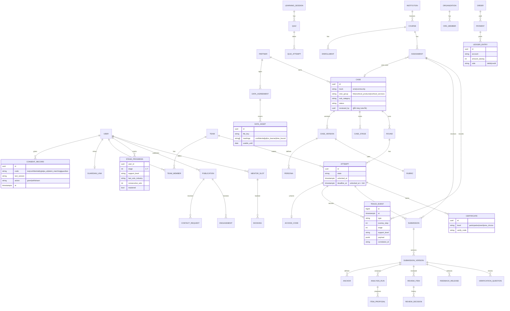

ตารางจาก mockup IDEAX (`ANCHOR`, `ITEM_PROPOSAL`, `REVIEW_DECISION`, `FEEDBACK_RELEASE`) คงรายละเอียดเดิม: anchor เก็บ `loc` + `hash`, decision เก็บทั้งค่า AI เสนอและค่ามนุษย์ให้, release เป็น snapshot `jsonb` ที่แก้ไม่ได้

---

## 15. Frontend route map

```
apps/web/app/
  (public)/                 หน้าแรก, หน้า publication สาธารณะ, ตรวจ certificate
  (auth)/signup, login, guardian/[token]
  (learner)/
    explore/                ขั้น 2–3
    attempts/[id]/
      first-draft/          4a
      learn/[session]/      4
      unlock/               5
      case/ data-room/ chat/[persona]/     6
      canvas/               7
      pushback/             8
      simulator/            9
      mentoring/            10
      deliverables/         11
      precheck/ submit/     12
      feedback/             13
    portfolio/              14 + เผยแพร่
    requests/               คำขอจากองค์กร
    courses/[id]/…          ฝั่งนักศึกษา IDEAX (mockup: sToday, sBrief, sPrecheck, sReceipt, sFeedback, sRevise)
  (instructor)/t/…          IDEAX (mockup: tQueue, tReview, tRelease, tSummary, piClass, piStudentView)
    courses/[id]/insights/  กลุ่มความเข้าใจ 4 กลุ่ม
  (partner)/p/
    cases/[id]/intake/      ส่งข้อมูล + markings
    cases/[id]/approve/     อนุมัติ booklet
    cases/[id]/shortlist/   อ่านผลงานที่ผ่านคัดกรอง + feedback
    market/…                องค์กร (mockup: cHome, cTrends, cTopics, cBrief, cResults, cDetail, cShortlist)
  (mentor)/m/               slots, Q&A inbox (SLA 72 ชม.), case review
  (ops)/ops/                case pipeline, rounds, DSAR, audit, diagnostics
```

Component กลาง: `StatusChip` (ฟ้า/เขียว/เทา), `EvidenceQuote`, `SupportLevelBadge` (Watch/Guided/Solo), `JourneySpine` (14 ขั้น), `StageMeter` (7-Stage), `DeadlineTimer`, `WatermarkedViewer`, `PersonaChat` (SSE), `AuditDrawer`

---

## 16. API contract

REST `/v1`, JSON, error `{code, message_th, details}` · ทุก request แนบ `X-Correlation-Id` · mutation ที่สร้างของใหม่แนบ `Idempotency-Key` · mutation ที่แก้พร้อมกันได้แนบ `If-Match`

### Identity & Consent

| Method | Path | หมายเหตุ |
|---|---|---|
| POST | `/auth/signup` | profile + consents[] |
| POST | `/auth/otp/verify` | ผ่าน AIS Open API |
| POST | `/identity/student-card` | อัปโหลด + ตรวจ |
| POST | `/consents/guardian/request` · `/confirm` | ผู้เยาว์ |
| POST | `/consents/:code/withdraw` | |
| POST | `/privacy-requests` | สิทธิเจ้าของข้อมูล |

### Case Library (Partner / Ops)

| Method | Path | หมายเหตุ |
|---|---|---|
| POST | `/partners/:id/agreements` | ข้อตกลงอนุญาตใช้ข้อมูล |
| POST | `/cases/:id/assets` | ไฟล์ + markings |
| POST | `/cases/:id/draft` | สั่ง AI ร่าง (async) |
| POST | `/cases/:id/expert-review` | `{decision, notes}` |
| POST | `/cases/:id/owner-approval` | `{approve, notes}` |
| POST | `/cases/:id/takedown` | → SUSPENDED |
| POST | `/rounds` | เปิดรอบ + deadline policy |

### Learner journey

| Method | Path | ขั้น |
|---|---|---|
| POST | `/teams`, `/teams/:id/invites` | 1 |
| GET | `/catalog/recommendations?track=&group=&province=` | 2–3 |
| POST | `/attempts` | 3 |
| GET / PUT | `/attempts/:id/brief`, `/attempts/:id/drafts/first` | 4a |
| GET | `/sessions/:id` · POST `/quizzes/:id/attempts` | 4 |
| POST | `/attempts/:id/unlock` | 5 |
| GET | `/booklets/:id/pages/:n` (watermarked render) | 6 |
| POST | `/persona-chats` · `/persona-chats/:id/messages` (SSE) | 6 |
| PUT | `/canvas/:id/sections/:key` · POST `/canvas/:id/coach` | 7 |
| POST | `/pushback/:id/rounds` (SSE) | 8 |
| POST | `/simulations/:id/runs` | 9 |
| GET | `/mentor-slots` · POST `/bookings` · POST `/qna` | 10 |
| POST | `/uploads` · `/email-drafts/:id/evaluate` · `/pitches` | 11 |
| POST | `/attempts/:id/precheck` | 12 |
| POST | `/attempts/:id/submissions` | ส่ง |
| GET | `/submissions/:id/feedback` | 13 |
| POST | `/verification/:submissionId/answers` | ก่อน 14 |
| POST | `/portfolio/exports` · GET `/certificates/:id` · GET `/public/certificates/:verifyCode` | 14 |
| GET | `/me/stages` | 7-Stage + support level |

### Evaluation (Judge / Partner)

| Method | Path | หมายเหตุ |
|---|---|---|
| GET | `/rounds/:id/submissions?screened=true` | shortlist สำหรับเจ้าของโจทย์ |
| POST | `/submissions/:id/reviews` | ยืนยัน/แก้ผล AI |
| POST | `/submissions/:id/feedback-drafts` | AI ช่วยร่างตามคู่มือ |
| POST | `/rounds/:id/awards` | Merit / SME's Choice |
| POST | `/rounds/:id/release` | ปล่อย feedback ทุกทีม |

### IDEAX Classroom (จาก mockup)

| Method | Path | หมายเหตุ |
|---|---|---|
| POST | `/courses` · `/courses/:id/enrollments` | |
| POST | `/courses/:id/assignments` | `{case_id?, rubric_id, verification: bool}` |
| GET | `/teacher/queue` | เรียง: ถึงกำหนด → ต้องตัดสินใจ → ฉบับแก้ → ช่องว่างร่วม |
| GET | `/reviews/:svid` | items + proposals + anchors |
| POST | `/reviews/:svid/items/:no/decision` | accept / grade / flag · 409 / 422 |
| POST | `/reviews/:svid/criteria/:cid/accept` | bulk = 1 decision |
| POST | `/reviews/:svid/items/:no/{annotations,undo}` | |
| POST | `/reviews/:svid/release` | revise / finalize |
| GET | `/courses/:id/insights` | 4 กลุ่ม + to-do |
| GET | `/cohorts/:id/prompt-idea` · POST `/prompt-idea/:id/{verify,discard,undo}` | ไม่รวมเข้าเกรด |

### Marketplace & Payments

| Method | Path | หมายเหตุ |
|---|---|---|
| GET | `/market/search` | publication index เท่านั้น |
| GET | `/market/publications/:id` | |
| POST | `/orgs/:id/shortlist` | note เห็นเฉพาะองค์กร |
| POST | `/contact-requests` · `/contact-requests/:id/{accept,partial,decline}` | ต้องมี `talent_matching` consent |
| POST | `/engagements` · `/engagements/:id/{approve,decline}` | ตัดเงินหลังอนุมัติ |
| POST | `/orders` · `/payments/webhook` | |
| GET | `/me/payouts` | ผู้เรียน / พี่เลี้ยง / SME |

### Platform

| Method | Path | หมายเหตุ |
|---|---|---|
| GET | `/audit?object=&correlation_id=` | แผง "บันทึกระบบ" |
| GET | `/diagnostics?submission_version=` | claim_dropped, extraction_gap, missing_artifact, analysis_run |

---

## 17. กฎที่ระบบต้อง enforce

### จาก mockup IDEAX

| รหัส | กฎ | Enforce ที่ |
|---|---|---|
| AC-01 | ส่งงานได้และได้ receipt แม้ AI ล่ม | commit receipt ก่อน enqueue, `AnalysisRun` แยกตาราง |
| AC-03 | claim ที่ชี้กลับไปยังผลงานไม่ได้ต้องไม่แสดง | AI worker validate anchor/quote → diag `claim_dropped` |
| AC-04 | ไม่เติมน้ำหนักที่ rubric ต้นฉบับไม่ระบุ | `rubric.weights = null` → ถ่วงเท่ากัน + ข้อความกำกับ |
| AC-05 | งานทีมเผยแพร่เมื่อทุกคนยืนยัน | `PublicationService.publish` |
| AC-06 | องค์กรค้นได้เฉพาะ publication และไม่ใบ้ว่างาน private มีอยู่ | search อ่าน index เดียว |
| AC-07 | ข้อมูลส่วนตัวเปิดหลังเจ้าของ accept, เก็บเป็น consent record | serializer + `consent_record` |
| AC-08 | ถอนแล้วลบ index + ปิด URL | event `publication.withdrawn` → 410 Gone |
| AC-10 | ส่วนที่อ่านไม่ได้ไม่มีข้อเสนอ | `NO_PROPOSAL` + reason |
| AC-11 | แก้พร้อมกันไม่เขียนทับ | optimistic lock + 409 |
| AC-12 | ผู้เรียนเห็นเฉพาะผลที่ release | อ่านจาก `feedback_release` เท่านั้น |

### จากแผน THAItern (รหัส 💡 เพื่อใช้อ้างใน test)

| รหัส | กฎ | ที่มา | Enforce ที่ |
|---|---|---|---|
| TX-01 | ผ่าน Stage ต้อง Solo pass 2 ครั้งติดกันใน 2 อุตสาหกรรมต่างกัน | หน้า 24, 28 | `StageProgressService` |
| TX-02 | เลือก SME/ชุมชนได้ 1 แห่งต่อรอบ และยังไม่เห็นปัญหาจริง | ตาราง 14 ขั้น 2–3 | `POST /attempts` + catalog serializer |
| TX-03 | ปลดล็อก booklet ต้องยืนยันตัวตนครบทีม + quiz ≥ 80% | ตาราง 14 ขั้น 1, 4; หน้า 26 | FSM guard `READY_TO_UNLOCK` |
| TX-04 | ส่งงานภายใน 14 วันนับจากได้รหัส | หน้า 26 | `attempt.deadline_at` + job หมดเวลา |
| TX-05 | booklet อ่านบนเว็บเท่านั้น, ลายน้ำชื่อผู้ใช้, ตรวจการเข้าใช้ผิดปกติ | หน้า 26–27 | render ฝั่ง server, ไม่มี URL ดาวน์โหลด |
| TX-06 | ทีมไม่เกิน 4 คน | หน้า 23 | `TeamService` |
| TX-07 | Mentoring อย่างน้อย 2 ครั้ง (เจ้าของโจทย์ 1 + ผู้เชี่ยวชาญ 1) | ตาราง 14 ขั้น 10 | FSM guard ก่อน `SUBMITTED` 💡 |
| TX-08 | AI Coach / Pushback ห้ามทำแทน | ตาราง 14 ขั้น 7–8 | system prompt + output check |
| TX-09 | Pre-submission Reviewer ไม่ใช่ผู้ตัดสิน | ตาราง 14 ขั้น 12 | precheck ไม่เขียนผลทางการ |
| TX-10 | ทุกทีมได้ feedback | หน้า 27, 42 | release ทั้งรอบ ไม่ใช่เฉพาะ shortlist |
| TX-11 | SME อ่านเฉพาะผลงานที่ผ่านคัดกรอง และจำกัดจำนวนต่อสัปดาห์ | หน้า 27, 41 | shortlist + quota |
| TX-12 | ผู้เยาว์ต้องมีความยินยอมผู้ปกครองผ่าน OTP | หน้า 25, 29; ภาคผนวก ข | `consent.guardian` guard |
| TX-13 | Talent Matching เป็นความยินยอมแยกและถอนได้ | ภาคผนวก ข ข้อ 7 | guard ใน contact/matching |
| TX-14 | ปกปิดข้อมูลระบุตัวบุคคลก่อนทำ booklet, เจ้าของอนุมัติก่อนเผยแพร่ | หน้า 30, 42 | Case FSM |
| TX-15 | ถอดเคส: ปิดการปลดล็อกใหม่, รอบที่เริ่มแล้วประสานต่อ | ภาคผนวก ค ข้อ 10 | `SUSPENDED` |
| TX-16 | ไม่ฝึกโมเดลด้วยข้อมูล SME, ใช้เป็นบริบทเท่านั้น | ตาราง 32 | AI provider config |
| TX-17 | ผู้เชี่ยวชาญตรวจทุกเคสและระบุชื่อผู้ตรวจ | หน้า 52 | `case.reviewed_by` บังคับ |
| TX-18 | AI แสดงแหล่งอ้างอิงที่ตรวจได้ และมนุษย์ตรวจผลที่มีผลกระทบสำคัญ | หน้า 53 | evidence quote + human release |
| TX-19 | ใช้ AI ใน IDEAX ต้องอยู่ในแพลตฟอร์มเพื่อเห็นกระบวนการ | หน้า 51 | assignment chat log |
| TX-20 | Verification mode มีไว้ให้กลับมาคิด ไม่ใช่จับผิด | หน้า 51 | event บันทึกเฉยๆ ไม่ลงโทษอัตโนมัติ |

---

## 18. KPI และ analytics events

ตัวชี้วัดตาราง 23 คำนวณจาก `trace_event` ได้โดยตรง

| KPI | เป้า | คำนวณจาก |
|---|---|---|
| Activation Rate | ≥ 60% | ผู้สมัครที่มี `draft.first.saved` หรือ action แรกในเคส |
| Time to Value | < 60 วินาที | `signup.completed` → action แรกในเคส |
| Module Completion | ≥ 70% | `session.completed` ครบ / ผู้เริ่ม |
| Comprehension Rate | ≥ 80% | `quiz.scored ≥ 80` |
| Delayed Comprehension | ลดไม่เกิน 15% | quiz ซ้ำหลัง 7–14 วัน (job ส่งแจ้งเตือน) |
| Feature Adoption | ≥ 50% | ผู้ใช้ `persona.asked`, `simulation.run`, `pushback.*`, `pitch.scored` |
| Skill Growth | ดีขึ้น 1 ระดับใน 3 เคส | banding เคสแรก vs ล่าสุดต่อ Stage |
| Skill Narrative Conversion | ≥ 40% | `portfolio.exported` + publication/แชร์ |
| On-the-job Application | baseline ปีแรก | แบบสอบถามติดตาม |

ข้อมูลเพิ่มที่ต้องเก็บเพื่อพิสูจน์พันธกิจ: สัดส่วนผู้เรียนนอกกรุงเทพฯ (เป้า ≥ 35% ระยะ 1, ≥ 45% ระยะ 2, และตาราง 37 เสนอให้ตั้งสูงกว่า 37.5%) จาก `profile.province`

---

## 19. ตาราง mockup action → API

| data-act | ฝั่ง | API | Audit (prev → next) |
|---|---|---|---|
| `accept` | อาจารย์ | `POST /reviews/:svid/items/:no/decision {accept}` | AI_PROPOSED → VERIFIED |
| `accept-cri` | อาจารย์ | `POST /reviews/:svid/criteria/:cid/accept` | AI_PROPOSED ×n → VERIFIED ×n (1 record) |
| `grade` / `m-save` | อาจารย์ | `POST …/decision {grade, reason}` | → VERIFIED |
| `flag` / `f-save` | อาจารย์ | `POST …/decision {flag, codes, reason}` | → RETURNED_FOR_REVISION |
| `ann` | อาจารย์ | `POST …/annotations` | U/D/J added/removed |
| `undo` | อาจารย์ | `POST …/undo` | → REOPENED |
| `t-conflict` / `cf-reload` | อาจารย์ | 409 → `GET /reviews/:svid` | concurrent_review_resolved |
| `t-release` | อาจารย์ | `POST /reviews/:svid/release` | IN_REVIEW → REVISION_REQUIRED / FINALIZED |
| `t-open-src` | อาจารย์ | `GET /submission-versions/:id/file` (signed URL) | – |
| `pi-verify` / `pi-drop` / `pi-undo` | อาจารย์ | `POST /prompt-idea/:id/…` | AI_PROPOSED → VERIFIED / DISCARDED / REOPENED |
| `pi-coach` | อาจารย์ | `POST /prompt-idea/:studentId/coach/release` | DRAFT → RELEASED |
| `s-precheck` | นักศึกษา | `POST …/precheck` | ADVISORY_ONLY |
| `s-save-disc` | นักศึกษา | `PUT …/disclosure` | – |
| `s-submit` | นักศึกษา | `POST /submissions` | DRAFT → SUBMITTED |
| `s-resubmit` | นักศึกษา | `POST /submissions/:id/versions` | → RESUBMITTED |
| `s-appeal` | นักศึกษา | **ยังไม่มี** (ต้องมี ReviewAppeal) | – |
| `s-publish` / `pub-confirm` | นักศึกษา | preview → `POST /publications/:id/publish` | → PUBLISHED |
| `s-withdraw` | นักศึกษา | `POST /publications/:id/withdraw` | → WITHDRAWN |
| `s-accept` / `s-partial` / `s-decline` | นักศึกษา | `POST /contact-requests/:id/…` | REQUESTED → … |
| `s-buy-ok` / `s-buy-no` | นักศึกษา | `POST /engagements/:id/{approve,decline}` | DISCUSSION → AGREED / CANCELLED |
| `c-query-go` / `c-search` / `c-parse` | องค์กร | `GET /market/search`, `POST /market/briefs/parse` | Search EXECUTED |
| `c-mvp` / `c-wtype` / `c-tier` / `c-sort` / `c-opp` | องค์กร | query params | – |
| `c-open` / `c-shortlist` | องค์กร | `GET /market/publications/:id`, `POST /orgs/:id/shortlist` | – |
| `ct-send` | องค์กร | `POST /contact-requests` | → REQUESTED |
| `buy-send` | องค์กร | `POST /engagements` | → DISCUSSION |
| `log` | ทุกฝั่ง | `GET /audit`, `GET /diagnostics` | – |
| `explain`, `aidown`, `reset`, `pane`, `opencri`, `anchor` | – | UI state / เครื่องมือเดโม | – |

---

## 20. ประเด็นที่ต้องตัดสินใจก่อนสร้าง

| # | ประเด็น | ข้อมูลที่ขัดกัน / ช่องว่าง | ผลต่อระบบ | ข้อเสนอ |
|---|---|---|---|---|
| D1 | **ลำดับ Productive Failure** | ตาราง 14 ให้เรียนก่อนเห็นโจทย์ และขั้น 2–3 ไม่เปิดเผยปัญหา แต่บทที่ 2 และ 5 เสนอให้ร่างคำตอบก่อนเรียน | ลำดับ FSM ขั้น 3–5 | ใช้ Challenge Brief ที่ไม่ลับสำหรับร่างแรก 30 นาที (ข้อ 7.1) และเปิด booklet หลัง quiz |
| D2 | สถานะองค์กร | ใบสมัคร: ไม่แสวงกำไร · แผนการเงิน: มีรายได้เชิงพาณิชย์ | ต้องมี Payments/Ledger หรือไม่, ภาษี | ตาราง 37 เสนอวิสาหกิจเพื่อสังคม → สร้าง Ledger ตั้งแต่ต้น |
| D3 | จำนวนโจทย์ปีแรก | 25 โจทย์ vs 240 เคส/ปี | ขนาดทีม Case Ops, ความจำเป็นของ AI drafting | ตัดสินพร้อมแผนรายได้ |
| D4 | โมเดล AI ต่องาน | ต้นแบบใช้ Gemini, ต้นทุนเคสคิดจาก Qwen | provider abstraction, ต้นทุน | ตั้ง config ต่อ task: persona, scoring, drafting, voice |
| D5 | ราคา Site Licence (IDEAX) | ยังว่าง | billing ระดับสถาบัน | กำหนดก่อนนำร่อง IDEAX |
| D6 | Community Track สำหรับนักเรียน ม.ปลาย | ผลสัมภาษณ์: นักเรียนสนใจเฉพาะโจทย์ธุรกิจ | การแนะนำ track ตามอายุ | เปิดทั้งสอง track แต่ไม่ผูกนักเรียนกับ Community |
| D7 | Mentoring บังคับก่อนส่ง? | ขั้น 10 ระบุ "อย่างน้อย 2 ครั้ง" แต่ SME มีเวลาจำกัด | FSM guard TX-07 | บังคับเข้า Office Hour กลุ่ม 1 ครั้ง + Q&A 1 ครั้ง |
| D8 | ReviewAppeal | mockup มีปุ่ม "ชี้แจง" แต่ไม่มี entity | state machine ใหม่ | เพิ่ม `REVIEW_APPEAL` (OPEN → ANSWERED / CLOSED) |
| D9 | Prompt & Idea เข้าเกรด? | mockup: ยังไม่รวมจนสถาบันตัดสิน | policy flag | flag ระดับ institution |
| D10 | จำนวนวันระงับเผยแพร่เมื่อ SME ขอถอด | ภาคผนวก ค ยังเว้นว่าง | SLA ของ takedown job | ใส่ใน DataAgreement เป็นค่าต่อสัญญา |
| D11 | การตัดสินขั้นแรกโดย AI ครอบคลุมแค่ไหน | "AI ประเมินพร้อมหลักฐาน → SME อ่านเฉพาะที่ผ่าน" | ความเสี่ยงที่ AI ตัดทีมออกผิด | กรรมการสุ่มตรวจกลุ่มที่ไม่ผ่านทุกรอบ |

---

## 21. ลำดับการพัฒนา

ตามตาราง 39 ของรายงาน: **นำร่อง THAItern ขนาดเล็ก → นำร่อง IDEAX 1 รายวิชา → รวมเป็นแพลตฟอร์มเดียว** โดยสร้าง engine ร่วมไว้ตั้งแต่ต้นเพื่อไม่ต้องรื้อ

| Milestone | ขอบเขต | ใช้ในขั้นของแผน | วัดผล |
|---|---|---|---|
| **M0 · Foundation** | Monorepo (`apps/web`, `apps/api`, `apps/ai`, `packages/contracts`), Docker Compose, auth + OTP, consent ledger, audit, `trace_event`, design tokens จาก mockup | ทุกขั้น | – |
| **M1 · Case pipeline** | Partner portal intake, markings, anonymize, AI draft, expert review, owner approval, takedown | 1 | เคสจริง 1–2 รายผ่าน Impvest |
| **M2 · THAItern core journey** | ขั้น 1–5 (ทีม, explore, ร่างแรก, sessions + quiz, unlock + 14 วัน), watermarked viewer | 1 | Activation, Time to Value |
| **M3 · AI workspace** | ขั้น 6–9 (Founder audio, Data room, Stakeholder chat SSE, Strategy Canvas coach, Pushback, Financial Simulator), Sawtooth + Stage progress | 1 | Feature Adoption |
| **M4 · Submit → Feedback → Portfolio** | ขั้น 10–14, AI screening + evidence, SME shortlist, release ทุกทีม, certificate 3 ระดับ, Portfolio PDF | 1 | อัตราการส่งงาน, ความพึงพอใจ SME, คุณภาพ feedback (ผู้เรียน 10–20 คน) |
| **M5 · IDEAX pilot** | Classroom, assignment จากเคส M1, หน้าตรวจ 3 pane (mockup), conflict 409, release snapshot, Verification mode, Insight 4 กลุ่ม, Prompt & Idea | 2 | เวลาตรวจที่ลดลง, ความแม่นยำการจัดกลุ่มเทียบอาจารย์ |
| **M6 · Marketplace & Payments** | Publication, search, contact unlock, idea purchase, mentor slots, ledger + payouts, Custom Challenge | 3 | จำนวนสถาบัน, ผู้ใช้, โจทย์ |

ทุก milestone ต้องมี automated test ครอบกฎในข้อ 17 ที่เกี่ยวข้อง และเดโม flow เดียวกับ mockup ได้บนข้อมูลจริง
