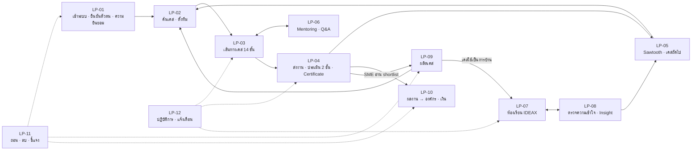

# Persona Brainstorm · Use Case ครบทุก Loop · THAItern × IDEAX

เอกสารนี้จำลองการระดมความคิดของ **Persona เป้าหมาย 10 คน** เพื่อหา Use Case ที่ใช้ออกแบบ Journey และ UX/UI ให้ครบทุก Loop ของแอป
ใช้คู่กับ [`APP_FLOW.md`](APP_FLOW.md) (flow และ API) และ [`WORK_PLAN.md`](WORK_PLAN.md) (สิ่งที่สร้างแล้ว)

## สารบัญ

0. [ที่มาและข้อจำกัด](#0-ที่มาและข้อจำกัด)
1. [Loop ทั้งหมดในแอป](#1-loop-ทั้งหมดในแอป)
2. [Persona 10 คน](#2-persona-10-คน)
3. [วงระดมความคิด (จำลอง) ทีละ Loop](#3-วงระดมความคิด-จำลอง-ทีละ-loop)
4. [Use Case Catalogue](#4-use-case-catalogue)
5. [ตาราง Persona × Loop](#5-ตาราง-persona--loop)
6. [Journey Map ราย Persona](#6-journey-map-ราย-persona)
7. [ความต้องการที่ขัดกัน และข้อตัดสิน](#7-ความต้องการที่ขัดกัน-และข้อตัดสิน)
8. [ข้อกำหนด UX/UI ที่ได้จากวงนี้](#8-ข้อกำหนด-uxui-ที่ได้จากวงนี้)
9. [Backlog เรียงลำดับ](#9-backlog-เรียงลำดับ)
10. [แผนทดสอบกับผู้ใช้จริง](#10-แผนทดสอบกับผู้ใช้จริง)

---

## 0. ที่มาและข้อจำกัด

**Persona ทั้ง 10 คนเป็นตัวละครสมมติ** แต่ทุกความต้องการและปัญหาอ้างข้อมูลในแผน:

| แหล่ง | ใช้ทำอะไร |
|---|---|
| ตาราง 10 · Persona โจ เนย พีท | ตั้งต้น Persona 1–3 |
| ตาราง 9, 31 · แบบสำรวจ n = 30 | ปัญหา แรงจูงใจ พฤติกรรมใช้ AI ความไว้ใจ อุปสรรคด้านอุปกรณ์ |
| สัมภาษณ์เชิงลึกคนที่ 1 (นักศึกษาที่เคยแข่ง Case และทำธุรกิจ) | คุณภาพ Booklet, การหาทีม, มุมมองเจ้าของธุรกิจ (อ่านได้ 2–3 งาน/สัปดาห์, ต้องมีคู่มือ feedback, คิดค่าตอบแทนรายชั่วโมง) |
| สัมภาษณ์คนที่ 2 (นักเรียน ม.ปลาย) | สนใจเฉพาะโจทย์ธุรกิจ ไม่สนใจ Community Track |
| ตาราง 32 · คำถามกรรมการ | Mentoring, แรงจูงใจ SME, การผลิตเคส |
| Panel 4 ก.ย. 2569 | B2B สำคัญกว่า B2C, ความเหลื่อมล้ำ, “Make it realistic”, ทดสอบโดยไม่บอกขั้นตอน |

**ข้อจำกัด**: นี่คือการจำลองเพื่อหาช่องว่างของการออกแบบ ไม่ใช่ผลวิจัยผู้ใช้ ทุก Use Case ที่ติดป้าย ⬜ ควรทดสอบกับผู้ใช้จริงก่อนสร้าง (ข้อ 10)

**สถานะในเอกสารนี้**: ✅ มีแล้วทั้ง API และหน้าจอ · 🟡 มีบางส่วน (เช่น มี API แต่ไม่มีหน้าจอ หรือเป็นโหมดเดโม) · ⬜ ยังไม่มี

---

## 1. Loop ทั้งหมดในแอป

แอปมี 12 Loop โดย Loop คือวงจรที่ผู้ใช้วนกลับมาทำซ้ำ หรือวงจรที่ผลของฝ่ายหนึ่งกลายเป็นข้อมูลนำเข้าของอีกฝ่าย

| Loop | ชื่อ | วงจร | ใครอยู่ในวง |
|---|---|---|---|
| LP-01 | เข้าระบบ ยืนยันตัวตน ความยินยอม | สมัคร → ยืนยัน → ให้/ถอนความยินยอม → สิทธิ์เปลี่ยน | ผู้เรียน, ผู้ปกครอง, ทุกบทบาท |
| LP-02 | ค้นพบเคสและตั้งทีม | สนใจ → กรอง → เลือก 1 เคส → ชวนทีม | ผู้เรียน |
| LP-03 | เส้นทางเคส 14 ขั้น | ร่างแรก → เรียน → ปลดล็อก → วิเคราะห์ ⇄ Pushback → Simulator → สื่อสาร → ตรวจก่อนส่ง | ผู้เรียน, AI |
| LP-04 | ประเมิน 2 ชั้นและ feedback | ส่ง → AI คัดกรอง → กรรมการยืนยัน → SME อ่าน shortlist → ปล่อย feedback ทุกทีม → ตรวจความเข้าใจ → Certificate | ผู้เรียน, กรรมการ, SME |
| LP-05 | Sawtooth และการเติบโตข้ามเคส | ผ่าน Solo 2 ครั้งติดใน 2 อุตสาหกรรม → Stage ถัดไป → เคสใหม่ | ผู้เรียน |
| LP-06 | Mentoring และ Q&A | ถาม → พี่เลี้ยงตอบใน 72 ชม. / Office Hour → ใช้คำตอบในงาน | ผู้เรียน, พี่เลี้ยง, SME |
| LP-07 | ห้องเรียน IDEAX | แจกงาน → ทำกับ AI ในแพลตฟอร์ม → ส่ง → AI เสนอ → อาจารย์ยืนยัน → ปล่อยผล → ส่งฉบับแก้ | อาจารย์, ผู้ช่วยตรวจ, นักศึกษา |
| LP-08 | ตรวจความเข้าใจและ Insight | ส่งงาน → คำถามจากงานตัวเอง → จัด 4 กลุ่ม → อาจารย์ลงมือ → รอบถัดไป | อาจารย์, นักศึกษา |
| LP-09 | ผลิตเคส | สัญญา → ข้อมูล → ปกปิด → AI ร่าง → ผู้เชี่ยวชาญตรวจ → เจ้าของอนุมัติ → เปิด → ถอด | SME, ชุมชน, Case Ops, ผู้เชี่ยวชาญ |
| LP-10 | ผลงานสู่องค์กร | เผยแพร่ → ค้น → Shortlist → ขอติดต่อ / ซื้อไอเดีย → ผู้เรียนตอบรับ → จ่ายเงิน → ส่วนแบ่ง | ผู้เรียน, องค์กร |
| LP-11 | สิทธิ์และการออก | ถอนความยินยอม / ถอนผลงาน / ขอถอดเคส / ชี้แจงผลตรวจ / ลบบัญชี → ระบบตามไปปิดทุกจุด | ทุกบทบาท |
| LP-12 | ปฏิบัติการและแจ้งเตือน | เหตุการณ์ → แจ้งเตือน → กลับมาทำต่อ · AI ล่ม → คิว → กู้ | ทุกบทบาท, ทีมงาน |

---

## 2. Persona 10 คน

### ภาพรวม

| # | ชื่อ | กลุ่ม | ประตู | Loop หลัก |
|---|---|---|---|---|
| P1 | **โจ** | นักศึกษาปี 2 ภูมิภาค (กลุ่มหลัก) | THAItern | 02, 03, 04, 05, 10 |
| P2 | **เนย** | นักเรียน ม.5 (ผู้เยาว์) | THAItern | 01, 03, 04 |
| P3 | **พีท** | นักศึกษาปี 3 ที่เคยแข่ง Case | THAItern | 03, 05, 06, 10 |
| P4 | **มายด์** | นักศึกษาปี 4 สายพัฒนาชุมชน | THAItern Community | 02, 03, 06, 12 |
| P5 | **ต้น** | นักศึกษาปี 1 ในรายวิชา | IDEAX | 07, 08, 11 |
| P6 | **ผศ.ดร. อรุณี** | อาจารย์ | IDEAX | 07, 08, 06 |
| P7 | **คุณวิภา** | เจ้าของ SME ร้านกาแฟ 3 สาขา | Partner | 09, 04, 11 |
| P8 | **ป้าบุญมา** | ประธานวิสาหกิจชุมชน | Partner Community | 09, 04, 06 |
| P9 | **คุณแพรว** | HR / Talent ของบริษัทค้าปลีก | องค์กร | 10, 09 (Custom Challenge) |
| P10 | **คุณกันต์** | Senior Associate ผู้เชี่ยวชาญ | Review · Judge · Mentor | 09, 04, 06 |

ผู้ร่วมวงที่ไม่ใช่ Persona หลักแต่ต้องมีใน Journey: ผู้ปกครองของเนย · ผู้ช่วยตรวจของอาจารย์ · หัวหน้าภาค (ผู้ซื้อ Site Licence) · Case Ops · ผู้ดูแลระบบ

### การ์ด Persona

#### P1 · โจ · 20 ปี · ปี 2 บริหารธุรกิจ มหาวิทยาลัยในภาคอีสาน
- **บริบท**: ใช้ Android ระดับกลาง เน็ตรายเดือน ทำงานได้ช่วงค่ำวันละ 1–2 ชม. ใช้ ChatGPT แบบคุยปรับหลายรอบ
- **เป้าหมาย**: ทำโจทย์จริงที่มีโครงสร้างพาทำ ได้ผลงานใส่ Resume ก่อนสมัครฝึกงานปี 3
- **ปัญหา** (ตาราง 9): Resume ว่าง ไม่มีทีม ไม่มีรุ่นพี่แนะนำ รู้สึกเริ่มช้ากว่าเพื่อนในกรุงเทพฯ · แบบสำรวจ: ไม่มีเครือข่าย 53.3%, ไม่รู้ช่องทาง 46.7%
- **คำพูด**: “ผมไม่รู้ว่าต้องเริ่มตรงไหน ขอแค่มีคนพาทำทีละขั้น แล้วบอกตรง ๆ ว่าผิดตรงไหน”
- **เลิกใช้เมื่อ**: ส่งงานแล้วเงียบ ไม่มี feedback · Booklet อ่านแล้วงง

#### P2 · เนย · 17 ปี · ม.5 โรงเรียนประจำจังหวัด เชียงราย
- **บริบท**: ใช้มือถือที่แม่ซื้อให้ ทำได้เฉพาะเสาร์–อาทิตย์และปิดเทอม มีสอบกลางภาค / ปลายภาค ต้องให้ผู้ปกครองยืนยัน OTP
- **เป้าหมาย**: ได้ผลงานและเกียรติบัตรใส่ Portfolio TCAS รอบ 1
- **ปัญหา**: กลัวไม่มีผลงานเด่น · ไม่มีบัตรนักศึกษา · สัมภาษณ์คนที่ 2: สนใจเฉพาะโจทย์ธุรกิจ
- **คำพูด**: “หนูอยากได้อะไรที่ใส่ Portfolio ได้เลย และแม่ต้องเข้าใจว่านี่ไม่ใช่มิจฉาชีพ”
- **เลิกใช้เมื่อ**: OTP ผู้ปกครองค้าง · 14 วันของเคสชนช่วงสอบ

#### P3 · พีท · 21 ปี · ปี 3 บัญชี มหาวิทยาลัยในกรุงเทพฯ
- **บริบท**: เคยแข่ง Case หลายรายการ หาทีมผ่านกลุ่ม Crack the Case ใช้ AI หลายตัวและรู้จุดอ่อนของมัน
- **เป้าหมาย**: งานที่มีผลกระทบจริง เครือข่ายข้ามสถาบัน อยากเป็นพี่เลี้ยงรุ่นน้อง
- **ปัญหา** (สัมภาษณ์คนที่ 1): Booklet ที่นักศึกษาเขียนคุณภาพต่ำและไม่สมจริง
- **คำพูด**: “ถ้า Booklet ไม่ต่างจากที่เคยเจอ ผมก็ไม่ทำ และถ้า AI ปล่อยผ่านง่าย ๆ ก็ไม่มีความหมาย”
- **เลิกใช้เมื่อ**: เคสไม่สมจริง · Pushback หลอกผ่านได้ · ไม่มีคนเก่งจริงให้คุยด้วย

#### P4 · มายด์ · 22 ปี · ปี 4 พัฒนาชุมชน มหาวิทยาลัยราชภัฏ ภาคใต้
- **บริบท**: ทำงานพิเศษร้านอาหาร เน็ตมักหมดกลางเดือน (แบบสำรวจ: เน็ตไม่เสถียร 13.8%, อุปกรณ์ไม่เหมาะ 20.7%) ชอบอัดเสียงมากกว่าพิมพ์
- **เป้าหมาย**: ช่วยชุมชนบ้านตัวเองจริง ได้ผลงานสายพัฒนาสังคมก่อนจบ
- **ปัญหา**: ทำได้แค่แบบสอบถามออนไลน์ ลงพื้นที่ไม่ได้บ่อย · ค่าเดินทาง 40%
- **คำพูด**: “หนูอยากให้งานไปถึงป้า ๆ ในชุมชนจริง ไม่ใช่จบที่สไลด์”
- **เลิกใช้เมื่อ**: เน็ตหลุดแล้วร่างหาย · ต้องอัปโหลดวิดีโอหนัก ๆ

#### P5 · ต้น · 19 ปี · ปี 1 ในรายวิชา Business Strategy (ประตู IDEAX)
- **บริบท**: ถูกบังคับใช้แพลตฟอร์มเพราะอาจารย์กำหนด ใช้ AI ทำงานเกือบทั้งหมด (กลุ่ม 16.7% ในแบบสำรวจ) ทำงานคืนก่อนส่ง
- **เป้าหมาย**: ได้เกรดดีโดยใช้เวลาน้อย
- **ปัญหา**: ไม่เห็นว่าทำเองแล้วได้อะไร กลัวถูกหาว่าลอก
- **คำพูด**: “ถ้า AI ทำได้ ทำไมต้องทำเอง… แต่ก็กลัวโดนจับ”
- **เลิกใช้เมื่อ**: รู้สึกถูกจับผิดตลอดเวลา · Verification mode ทำให้เหมือนสอบ

#### P6 · ผศ.ดร. อรุณี · 45 ปี · อาจารย์มหาวิทยาลัยในภาคเหนือ
- **บริบท**: สอน 3 กลุ่มเรียน 140 คน ใช้ LMS ของมหาวิทยาลัย ต้องส่ง มคอ. / รายงานประกันคุณภาพ
- **เป้าหมาย**: รู้ว่าใครเข้าใจจริง ตรวจเร็วขึ้นแต่ยังยุติธรรม อยากเป็นพี่เลี้ยงนักศึกษาต่างจังหวัด (จุดเชื่อมสองประตู)
- **คำพูด**: “ฉันไม่ได้อยากจับผิด อยากรู้ว่าใครเข้าใจ และต้องอธิบายเกรดให้นักศึกษาได้ทุกข้อ”
- **เลิกใช้เมื่อ**: AI ให้ผลที่อธิบายไม่ได้ · ต้องกรอกคะแนนซ้ำใน LMS

#### P7 · คุณวิภา · 41 ปี · เจ้าของร้านกาแฟและเบเกอรี่ 3 สาขา เชียงใหม่
- **บริบท**: ใช้ LINE และ Excel เป็นหลัก เวลาน้อยมาก
- **เป้าหมาย**: ได้มุมมองคนรุ่นใหม่ต่อปัญหาจริง คัดเด็กฝึกงาน ภาพลักษณ์ (ตาราง 32)
- **ปัญหา** (สัมภาษณ์คนที่ 1): อ่านได้ 2–3 งาน/สัปดาห์ · ต้องมีคู่มือเขียน feedback เพราะอ่อนไหว · คุ้มถ้าค่าใช้จ่ายต่ำ
- **คำพูด**: “ให้ข้อมูลได้ แต่คู่แข่งต้องไม่รู้ว่าเป็นร้านฉัน และอย่าให้ต้องอ่านห้าสิบงาน”
- **เลิกใช้เมื่อ**: ข้อมูลรั่ว · งานเอกสารเยอะ · ไม่ได้อะไรกลับมา

#### P8 · ป้าบุญมา · 58 ปี · ประธานวิสาหกิจชุมชนผ้าย้อมคราม สกลนคร
- **บริบท**: ใช้ LINE และส่งข้อความเสียง ตัวหนังสือต้องใหญ่ ไม่มีคอมพิวเตอร์ (Panel: ผู้สูงอายุใช้สมาร์ตโฟนมากขึ้น)
- **เป้าหมาย**: เด็กมาช่วยแบบเข้าใจวิถีชุมชน ได้ทางไปหาทุนหรือตลาด
- **คำพูด**: “อยากให้เด็กมาเห็นของจริง ไม่ใช่เขียนแผนสวย ๆ แล้วหายไป”
- **เลิกใช้เมื่อ**: แบบฟอร์มยาก · ผลงานไม่เคารพวัฒนธรรม · ไม่มีใครตามต่อ

#### P9 · คุณแพรว · 34 ปี · Talent Acquisition Lead บริษัทค้าปลีก 300 คน
- **บริบท**: ใช้คอมพิวเตอร์ทั้งวัน ต้องการใบกำกับภาษี ต้องทำตาม PDPA
- **เป้าหมาย**: หาเด็กฝึกงานจากภูมิภาคที่มีหลักฐานการคิด ซื้อไอเดียสินค้าใหม่ พิจารณาเป็น Custom Challenge Sponsor
- **คำพูด**: “Resume บอกไม่ได้ว่าใครคิดเป็น ถ้าเห็นร่องรอยการคิดจะช่วยมาก แต่ต้องรู้ว่าส่วนไหน AI ทำ”
- **เลิกใช้เมื่อ**: ติดต่อผู้สมัครช้า · ไม่รู้ว่าผลงานเป็นของคนหรือ AI

#### P10 · คุณกันต์ · 31 ปี · Senior Associate บริษัทที่ปรึกษา
- **บริบท**: ให้เวลาได้เดือนละประมาณ 4 ชม. ทำได้ทั้งตรวจเคส กรรมการ และพี่เลี้ยง
- **เป้าหมาย**: ใช้เวลาให้คุ้ม ได้ค่าตอบแทนรายชั่วโมง ได้ชื่อในฐานะผู้ตรวจ
- **คำพูด**: “ผมมีเดือนละสี่ชั่วโมง อย่าให้เสียกับคำถามซ้ำ ๆ หรืองานที่ AI กรองได้”
- **เลิกใช้เมื่อ**: ทำฟรี · rubric ไม่ชัด · ตอบคำถามเดิมซ้ำ

---

## 3. วงระดมความคิด (จำลอง) ทีละ Loop

รูปแบบ: แต่ละรอบถามหนึ่งคำถามต่อหนึ่ง Loop ให้ Persona ที่เกี่ยวข้องตอบ แล้วสรุปเป็น Use Case (รหัสอ้างข้อ 4)

### รอบ 1 · LP-01 “ก่อนเริ่มใช้ อะไรทำให้คุณกล้าหรือไม่กล้าให้ข้อมูล”

> **เนย**: หนูไม่มีบัตรนักศึกษา ถ้าระบบขอแต่บัตรนักศึกษาหนูก็ไปต่อไม่ได้
> **แม่ของเนย** (ผู้ร่วมวง): ได้ SMS รหัสมาแล้วไม่รู้ว่าเว็บอะไร ขอดูก่อนได้ไหมว่าลูกจะทำอะไร และยกเลิกเองได้ไหม
> **โจ**: อยากลองทำเลยก่อน ยังไม่อยากถ่ายบัตร
> **ต้น**: ผมเข้าด้วยบัญชีมหาวิทยาลัยได้ไหม ไม่อยากสมัครใหม่
> **ป้าบุญมา**: ป้าไม่สมัครเองนะ ให้คนมาช่วยทำให้

**ได้**: UC-01 ถึง UC-09 · สำคัญที่สุดคือ ผู้เยาว์ยืนยันตัวตนด้วยบัตรนักเรียน (UC-04), หน้าอธิบายสำหรับผู้ปกครอง (UC-06), และเข้าด้วย SSO (UC-08)

### รอบ 2 · LP-02 “คุณเลือกเคสและหาทีมอย่างไร”

> **โจ**: ผมไม่มีทีม ถ้าต้องมีทีมผมก็ไม่ได้ทำ อยากให้ระบบจับคู่คนที่สนใจเรื่องเดียวกัน
> **พีท**: ผมอยากรู้ว่าใครเขียนเคส ผู้เชี่ยวชาญตรวจไหม (แบบสำรวจ: 58.6% เชื่อเคสจากผู้เชี่ยวชาญ/สถาบันที่รู้จัก)
> **เนย**: หนูอยากเห็นก่อนว่าต้องใช้เวลากี่ชั่วโมง และช่วงไหนว่าง
> **มายด์**: อยากเลือกชุมชนในจังหวัดตัวเอง
> **คุณวิภา**: อย่าให้เด็กรู้ว่าเป็นร้านไหนตั้งแต่หน้าเลือกนะ

**ได้**: UC-10 ถึง UC-16 · ช่องว่างคือ การจับคู่ทีมข้ามสถาบัน (UC-13) และหน้าทีม (UC-14) · ชื่อผู้ตรวจเคสบนการ์ดมีแล้ว (UC-11)

### รอบ 3 · LP-03 “ระหว่างทำเคส ตรงไหนที่ทำให้อยากเลิก หรืออยากทำต่อ”

> **โจ**: ร่างแรก 30 นาทีดีมาก เพราะรู้ว่าตัวเองไม่รู้อะไร แต่ถ้าเน็ตหลุดตอนจับเวลาจะเครียด
> **มายด์**: หนูอยากพูดแทนพิมพ์ แล้วให้ระบบถอดเป็นตัวหนังสือ · ร่างต้องเก็บในเครื่องไว้ก่อน
> **พีท**: Pushback ต้องไล่ถามจนเจอจุดอ่อนจริง ถ้าผมตอบแค่ใส่ตัวเลขแล้วผ่าน ก็ไม่ต่างจากไม่มี
> **เนย**: หนูไม่เข้าใจว่า Unit Economics คืออะไร อยากได้ตัวอย่างก่อน (ระดับ WATCH)
> **คุณกันต์**: Stakeholder Chat ต้องตอบว่า “ไม่ทราบ” เมื่อไม่มีข้อมูล ไม่งั้นเด็กจะเชื่อข้อมูลปลอม (แบบสำรวจ: 63.3% ไม่ไว้ใจเพราะ AI ให้ข้อมูลผิดแต่ดูน่าเชื่อ)
> **โจ**: อยากเห็นว่าตอนนี้อยู่ขั้นไหน เหลืออีกกี่วัน

**ได้**: UC-17 ถึง UC-32 · ช่องว่างใหญ่คือ ขั้น 11 เครื่องมือสื่อสาร (UC-29), พิมพ์ด้วยเสียง (UC-31), และเก็บร่างแบบออฟไลน์ (UC-32)

### รอบ 4 · LP-04 “หลังส่งงาน อยากได้อะไร”

> **โจ**: บอกตรง ๆ ว่าผิดตรงไหน มีตัวอย่างเทียบ (แบบสำรวจ: 41.4% ต่อข้อ)
> **คุณวิภา**: ฉันอ่านได้แค่ 2–3 งาน ให้ AI ช่วยร่าง feedback ได้ แต่ฉันต้องแก้เองได้ และมีคู่มือว่าเขียนยังไงไม่ให้เด็กเสียใจ
> **ป้าบุญมา**: ป้าอยากฟังเด็กนำเสนอ ไม่อยากอ่านยาว ๆ ขอเป็นวิดีโอสั้นหรือเสียง
> **คุณกันต์**: ต้องสุ่มตรวจกลุ่มที่ AI ให้ไม่ผ่านด้วย ไม่งั้นทีมดีอาจหลุด
> **เนย**: เกียรติบัตรต้องตรวจสอบได้ว่าของจริง ครูแนะแนวจะได้เชื่อ
> **ต้น**: ถ้าไม่เห็นด้วยกับผลตรวจ ชี้แจงได้ไหม

**ได้**: UC-33 ถึง UC-43 · ช่องว่างคือ ให้ SME ดูงานแบบวิดีโอ/เสียง (UC-38), สุ่มตรวจกลุ่มที่ไม่ผ่าน (UC-36), ชี้แจงผลตรวจ (UC-42)

### รอบ 5 · LP-05 “อะไรทำให้กลับมาทำเคสที่สอง”

> **โจ**: อยากเห็นเลเวลขึ้น (แบบสำรวจ: 58.6% อยากได้คะแนนและเลเวล)
> **พีท**: อย่ามี Leaderboard ระหว่างคน ผมไม่อยากแข่งกับน้องปี 1 แต่อยากเห็นว่าตัวเองเก่งขึ้นเรื่องไหน
> **เนย**: ปิดเทอมแล้วค่อยกลับมาทำ ขอให้ระบบเตือน
> **ผศ.ดร. อรุณี**: ถ้าเด็กทำเคสในวิชาแล้ว ให้นับเป็นความก้าวหน้าในประตูเปิดด้วย

**ได้**: UC-44 ถึง UC-49 · ตัดสินให้ใช้ “เลเวลต่อทักษะของตัวเอง” ไม่ใช้ Leaderboard (ข้อ 7)

### รอบ 6 · LP-06 “คุยกับคนจริงอย่างไรให้คุ้มทั้งสองฝ่าย”

> **โจ**: อยากคุยกับคนทำงานจริงสักครั้ง (แบบสำรวจ: 65.5%)
> **คุณกันต์**: Office Hour กลุ่มดีกว่าตัวต่อตัว ส่งคำถามล่วงหน้า ผมจะตอบรวม · คำถามซ้ำให้ AI ตอบจากคำตอบเก่าของผม
> **คุณวิภา**: ให้พนักงานเป็นพี่เลี้ยงทั้งวันไม่ได้ ถ้าคิดรายชั่วโมงคุยได้
> **ป้าบุญมา**: ป้าคุยทาง LINE วิดีโอคอลได้ ให้เด็กมาเป็นกลุ่ม
> **มายด์**: ถ้าต้องจ่าย 350 บาทต่อครั้ง หนูจ่ายไม่ไหว

**ได้**: UC-50 ถึง UC-56 · ทั้ง Loop ยังไม่มี (ตรงกับ D7) และต้องมีโควตาฟรีหรือทุนสำหรับผู้เรียนรายได้น้อย (UC-56)

### รอบ 7 · LP-07 “ในห้องเรียน อยากให้แพลตฟอร์มทำอะไร”

> **ผศ.ดร. อรุณี**: สร้างงานจากเคส THAItern ได้เลย แนบ rubric เดิมของฉัน แล้วส่งคะแนนกลับ LMS
> **ต้น**: ขอเห็นว่าส่งแล้วจริง มีใบรับ · และ AI ในแพลตฟอร์มต้องช่วยได้จริง ไม่ใช่แค่ถามกลับอย่างเดียว
> **ผู้ช่วยตรวจ**: ถ้าอาจารย์กับผมตรวจข้อเดียวกันพร้อมกัน อย่าให้ของใครหาย
> **ผศ.ดร. อรุณี**: ผลที่ปล่อยต้องไม่เปลี่ยนภายหลัง และนักศึกษาเห็นเฉพาะที่ฉันยืนยัน
> **หัวหน้าภาค**: ขอรายงานรวมทุกกลุ่มเรียนไปทำประกันคุณภาพ

**ได้**: UC-57 ถึง UC-68 · ช่องว่างคือ หน้าสร้างรายวิชาและงาน (UC-57), ส่งคะแนนออก LMS (UC-66), รายงานระดับคณะ (UC-67)

### รอบ 8 · LP-08 “จะรู้ได้อย่างไรว่าเข้าใจจริง โดยไม่ทำให้รู้สึกถูกจับผิด”

> **ต้น**: ถ้าปิด paste แล้วบอกเหตุผลก่อน ผมก็โอเค แต่อย่าขึ้นแดงว่าผมโกง
> **ผศ.ดร. อรุณี**: ขอกลุ่ม “งานดีแต่ยังอธิบายไม่ได้” พร้อม to-do ว่าควรคุยอะไร
> **เนย**: คำถามจากงานของตัวเองดี เพราะหนูอธิบายได้ถ้าทำเอง

**ได้**: UC-69 ถึง UC-73 · ภาษาในหน้าจอ Verification ต้องเป็นการชวนคิด ไม่ใช่การกล่าวหา

### รอบ 9 · LP-09 “การให้ข้อมูลทำเคส ต้องง่ายและปลอดภัยแค่ไหน”

> **คุณวิภา**: ส่ง Excel ยอดขายกับอัดเสียงเล่าปัญหาได้ไหม ไม่อยากกรอกฟอร์ม · ก่อนเปิดขอดู Booklet ฉบับที่เด็กจะเห็น
> **ป้าบุญมา**: ให้ทีมงานมาสัมภาษณ์ป้าแล้วทำให้ · ภาพชุมชนต้องได้รับอนุญาตจากคนในภาพ
> **คุณกันต์**: ผมตรวจเคสได้ถ้ามี checklist ชัด และชื่อผมขึ้นในฐานะผู้ตรวจ
> **คุณแพรว**: บริษัทอยากตั้งโจทย์เอง (Custom Challenge) และเห็นผลงานของเคสเราเท่านั้น
> **คุณวิภา**: ถ้าเปลี่ยนใจ ขอถอดเคสได้เร็วแค่ไหน

**ได้**: UC-74 ถึง UC-84 · ช่องว่างคือ รับข้อมูลทาง LINE/เสียง (UC-75), Custom Challenge (UC-83), จ่ายค่าตอบแทนเจ้าของเคส (UC-84)

### รอบ 10 · LP-10 “ผลงานควรไปถึงองค์กรอย่างไร”

> **คุณแพรว**: ค้นด้วยโจทย์ธุรกิจของเรา เห็นว่าส่วนไหน AI ทำ ส่วนไหนคนทำ แล้วขอติดต่อได้ทันที
> **โจ**: ถ้ามีบริษัทขอติดต่อ อยากเลือกได้ว่าจะให้อีเมลหรือเบอร์
> **พีท**: ผลงานทีม ต้องให้ทุกคนในทีมตกลงก่อนเผยแพร่
> **คุณวิภา**: ถ้าบริษัทซื้อไอเดียจากเคสร้านฉัน ฉันควรรู้และได้ส่วนแบ่งไหม
> **คุณแพรว**: ต้องมีใบกำกับภาษีและรายการจ่ายเงิน

**ได้**: UC-85 ถึง UC-96 · ประเด็นใหม่ที่ต้องตัดสิน: เจ้าของเคสมีสิทธิ์อะไรเมื่อไอเดียจากเคสตัวเองถูกซื้อ (ข้อ 7 T5)

### รอบ 11 · LP-11 “ถ้าอยากถอยออก ระบบต้องทำอะไร”

> **แม่ของเนย**: ถอนความยินยอมแล้ว ข้อมูลลูกต้องหายจากที่องค์กรเห็น
> **โจ**: ถอนผลงานแล้วลิงก์ที่ส่งไปต้องใช้ไม่ได้
> **คุณวิภา**: ขอถอดเคสแล้ว เด็กที่กำลังทำอยู่จะเป็นยังไง
> **ต้น**: ชี้แจงผลตรวจได้ และอาจารย์ต้องตอบในเวลาที่กำหนด
> **มายด์**: เรียนจบแล้วขอเอาผลงานทั้งหมดออกไปเป็นไฟล์

**ได้**: UC-97 ถึง UC-103

### รอบ 12 · LP-12 “ระบบต้องเตือนหรือช่วยเมื่อไร”

> **โจ**: เตือนก่อนหมดเวลา 14 วัน 3 วัน และ 1 วัน
> **คุณกันต์**: สรุปรายสัปดาห์ครั้งเดียว อย่าส่งทุกเรื่อง
> **ป้าบุญมา**: ส่งทาง LINE
> **ผศ.ดร. อรุณี**: ถ้า AI ล่ม งานที่ส่งต้องไม่หาย และบอกนักศึกษาตรง ๆ ว่ากำลังรอ
> **คุณวิภา**: ถ้ามีคนพยายามดาวน์โหลด Booklet ทั้งเล่ม ต้องรู้

**ได้**: UC-104 ถึง UC-110

---

## 4. Use Case Catalogue

รูปแบบ: **เมื่อ** (สถานการณ์) · **ต้องการ** (สิ่งที่ทำ) · **เพื่อ** (ผลที่ได้) · เงื่อนไขที่ต้องจริง · สถานะ · หน้าจอ / API ที่เกี่ยวข้อง

### LP-01 · เข้าระบบ ยืนยันตัวตน ความยินยอม

| รหัส | Persona | Use Case | เงื่อนไขที่ต้องจริง | สถานะ | หน้าจอ / API |
|---|---|---|---|---|---|
| UC-01 | P1 P2 P4 | สมัครด้วยข้อมูลขั้นต่ำ แล้วเข้า Challenge Brief ได้ภายใน 60 วินาที | Time to Value < 60 วิ · ยังไม่ต้องยืนยันบัตร | ✅ | `/signup` · `POST /v1/auth/signup` |
| UC-02 | P1 P3 P4 | ยืนยันบัตรนักศึกษาก่อนเปิดข้อมูลลับของ SME | ปลดล็อก Booklet ไม่ได้ถ้ายังไม่ยืนยัน | 🟡 เดโม ยังไม่มีคนตรวจจริง | `/s/profile` · `POST /v1/identity/student-card` |
| UC-03 | P2 | ผู้เยาว์ส่ง OTP ให้ผู้ปกครอง และส่งใหม่ได้ | อายุ < 20 ต้องมี guardian consent ก่อนเปิด Booklet | 🟡 OTP เดโม ยังไม่ส่ง SMS จริง | `POST /v1/consents/guardian/*` |
| UC-04 | P2 | นักเรียน ม.ปลายยืนยันด้วยบัตรนักเรียนหรือครูรับรองแทนบัตรนักศึกษา | ช่องทางยืนยันขึ้นกับระดับการศึกษา | ⬜ | `/s/profile` |
| UC-05 | ทุกผู้เรียน | ให้และถอนความยินยอมแยกตามวัตถุประสงค์ (AI + Trace, Talent Matching) | ถอนแล้วมีผลทันทีทุกระบบ | ✅ | `/s/profile` · `POST /v1/consents/:code/:action` |
| UC-06 | ผู้ปกครอง | เปิดลิงก์จาก SMS เห็นหน้าอธิบายภาษาง่ายว่าลูกจะทำอะไร ข้อมูลอะไรถูกใช้ แล้วยืนยันหรือปฏิเสธ | ไม่ต้องสมัครบัญชี | ⬜ | หน้าใหม่ `/guardian/:token` |
| UC-07 | ผู้ปกครอง | ดูสถานะและถอนความยินยอมได้เองภายหลัง | ถอนแล้วปิด Booklet และคำขอติดต่อ | ⬜ | `/guardian/:token` |
| UC-08 | P5 P6 | เข้าด้วยบัญชีมหาวิทยาลัย (SSO) | บัญชีผูกกับรายวิชาอัตโนมัติ | ⬜ | – |
| UC-09 | P7 P8 P10 | เจ้าของเคสและผู้เชี่ยวชาญเข้าด้วยลิงก์เชิญจาก Case Ops ไม่ต้องสมัครเอง | ลิงก์ใช้ครั้งเดียว มีวันหมดอายุ | ⬜ | – |

### LP-02 · ค้นพบเคสและตั้งทีม

| รหัส | Persona | Use Case | เงื่อนไขที่ต้องจริง | สถานะ | หน้าจอ / API |
|---|---|---|---|---|---|
| UC-10 | P1 P2 | กรองเคสตาม Track (SME / ชุมชน) ประเภทธุรกิจ และพื้นที่ | ไม่แสดงปัญหาและชื่อจริงของเจ้าของ | ✅ | `/l/explore` · `GET /v1/catalog/filters`, `/v1/catalog` |
| UC-11 | P3 | เห็นบนการ์ดเคสว่าผู้เชี่ยวชาญคนไหนตรวจ | แสดงชื่อผู้ตรวจเมื่อผู้ตรวจยินยอม | ✅ | `/l/explore` |
| UC-12 | P2 | เห็นเวลาที่ต้องใช้ (ชม.) ช่วงเปิดรับ และ deadline ก่อนเลือก | – | 🟡 มีรอบและ 14 วัน ยังไม่มีประมาณชั่วโมง | `/l/explore` |
| UC-13 | P1 | หาเพื่อนร่วมทีมข้ามสถาบันตามความสนใจ จังหวัด และเวลาว่าง | ทีม ≤ 4 · ไม่เปิดข้อมูลติดต่อจนตอบรับ | ⬜ | หน้าใหม่ `/teams/find` |
| UC-14 | P1 P3 | สร้างทีมและเชิญเพื่อน | ทุกคนต้องยืนยันตัวตนก่อนปลดล็อก | 🟡 มี API ไม่มีหน้าจอ | `POST /v1/teams`, `/v1/teams/:id/members` |
| UC-15 | P4 | เลือกชุมชนจากจังหวัดของตัวเองก่อน | – | ✅ กรองตามพื้นที่ได้ | `/l/explore` |
| UC-16 | P1 | เลือกได้ 1 เคสต่อรอบ และรู้ว่าจะเปลี่ยนได้เมื่อไร | TX: 1 เคส/รอบ | ✅ | `POST /v1/attempts` |

### LP-03 · เส้นทางเคส 14 ขั้น

| รหัส | Persona | Use Case | เงื่อนไขที่ต้องจริง | สถานะ | หน้าจอ / API |
|---|---|---|---|---|---|
| UC-17 | P1 P2 | ร่างคำตอบแรก 30 นาทีจาก Challenge Brief | ร่างนี้ไม่ถูกประเมิน ใช้เป็น baseline | ✅ | `/l/a/:id` · `…/first-draft` |
| UC-18 | P1 P4 | เน็ตหลุดระหว่างจับเวลา กลับมาแล้วร่างยังอยู่ และเวลาคิดตามจริงจาก server | เวลาเริ่มบันทึกที่ server | 🟡 เวลาอยู่ที่ server แล้ว ร่างยังไม่เก็บในเครื่อง | `…/first-draft/start` |
| UC-19 | P2 | เรียน 4 เซสชัน + Quiz ≥ 80% ก่อนปลดล็อก | ทำ Quiz ซ้ำได้ | ✅ | `…/sessions`, `…/quiz` |
| UC-20 | P2 | Special Session 2 ครั้ง (สด / ดูย้อนหลัง) | นับเมื่อดูครบ | ⬜ | – |
| UC-21 | P1 | ปลดล็อก Booklet ด้วยรหัส แล้วเริ่มนับ 14 วัน | รหัสผูกกับผู้ใช้/ทีม | ✅ | `…/unlock` |
| UC-22 | P7 P3 | อ่าน Booklet บนเว็บเท่านั้น มีลายน้ำชื่อผู้อ่าน | ไม่มีปุ่มดาวน์โหลด | ✅ | `…/booklet` |
| UC-23 | P1 P4 | ดู Data Room เป็นตาราง อ่านบนมือถือได้ | – | ✅ | `/l/a/:id` |
| UC-24 | P1 P2 P4 | ฟังเจ้าของเล่าปัญหา (Founder Audio) | ไฟล์เสียงเล็ก เล่นแบบ stream | ⬜ | – |
| UC-25 | P1 P10 | สัมภาษณ์ AI Persona ที่ตอบจากข้อมูลในเคสเท่านั้น ไม่รู้ต้องตอบว่าไม่ทราบ | ห้ามแต่งข้อมูล | ✅ | `…/personas/:key/messages` (SSE) |
| UC-26 | P1 P2 | เขียน Strategy Canvas 5 ส่วน โดย Coach ถามกลับ ไม่เขียนแทน | ระดับความช่วยเหลือตาม Sawtooth | ✅ | `…/canvas/:section`, `…/coach` |
| UC-27 | P3 | ถูก Pushback ท้าทายจนกว่าจะตอบข้อโต้แย้งได้จริง | ต้องผ่านก่อน Simulator | 🟡 ผ่านได้ด้วยการอ้างข้อมูล ยังไม่ตรวจว่าตอบตรงคำถาม (mock) | `…/pushback/*` |
| UC-28 | P1 | ลองปรับราคา การตลาด คนงาน ใน Simulator แล้วเห็นผลทันที | deterministic | ✅ | `…/simulate` |
| UC-29 | P1 P3 P8 | ทำชิ้นงานสื่อสาร: สไลด์ วิดีโอ 2 นาที Executive Email และ Pitch the Board | อัปโหลดไฟล์ บีบอัดวิดีโอ | ⬜ | – |
| UC-30 | P1 | ตรวจก่อนส่ง (advisory) บอกสิ่งที่ขาด ไม่บอกเปอร์เซ็นต์ความพร้อม | ห้ามแสดงเปอร์เซ็นต์ | ✅ | `…/precheck` |
| UC-31 | P4 P8 | พิมพ์ด้วยเสียงในทุกช่องข้อความยาว | ถอดเสียงเป็นข้อความก่อนบันทึก | ⬜ | – |
| UC-32 | P4 | ร่างทุกช่องบันทึกในเครื่องก่อน แล้วส่งขึ้นเมื่อเน็ตกลับมา | ไม่ทับฉบับที่ใหม่กว่า | ⬜ | – |

### LP-04 · ส่งงาน ประเมิน 2 ชั้น feedback certificate

| รหัส | Persona | Use Case | เงื่อนไขที่ต้องจริง | สถานะ | หน้าจอ / API |
|---|---|---|---|---|---|
| UC-33 | P1 | ส่งงานแล้วได้ใบรับทันที แม้ AI ยังประเมินไม่เสร็จ | AC-01 | ✅ | `…/submit` |
| UC-34 | P10 | กรรมการเห็นข้อเสนอ AI รายเกณฑ์พร้อมประโยคหลักฐาน แล้วยืนยันหรือแก้ | ประโยคหลักฐานต้องชี้กลับไปยังงานได้ | ✅ | `/p/c/:id` · `/v1/partner/submissions/:id/confirm` |
| UC-35 | P7 | SME อ่านเฉพาะ shortlist ไม่เกินโควตาต่อสัปดาห์ | โควตาต่อเจ้าของ | ✅ | `/v1/partner/cases/:id/shortlist` |
| UC-36 | P10 | สุ่มตรวจงานที่ AI ให้ไม่ผ่านทุกรอบ | ทุกรอบต้องมีตัวอย่างจากกลุ่มไม่ผ่าน (D11) | ⬜ | – |
| UC-37 | P7 | ให้ AI ร่าง feedback ตามคู่มือ แล้วแก้เองก่อนยืนยัน | ร่างเป็นสีฟ้าจนเจ้าของยืนยัน | ✅ | `…/feedback-draft`, `…/owner-feedback` |
| UC-38 | P8 | ตัวแทนชุมชนดูงานแบบวิดีโอสั้นหรือฟังเสียงบนมือถือ ให้คะแนนด้วยปุ่มใหญ่ และตอบด้วยเสียง | – | ⬜ | – |
| UC-39 | P1 | ทุกทีมได้ feedback ที่มนุษย์ยืนยัน พร้อมตัวอย่างเทียบ | AC-12 | 🟡 มี feedback ยังไม่มีตัวอย่างเทียบ | `…/feedback` |
| UC-40 | P2 P5 | ตอบคำถามตรวจความเข้าใจจากงานตัวเองก่อนรับ Certificate | ต้องผ่านก่อนออก | ✅ | `…/verification/:position` |
| UC-41 | P2 | รับ Certificate 3 ระดับ มีลิงก์ให้ครูแนะแนวตรวจสอบได้ | หน้า verify ไม่เปิดข้อมูลส่วนตัวเกินจำเป็น | ✅ | `/verify/:code` |
| UC-42 | P1 P5 | ชี้แจงผลตรวจรายข้อ และได้คำตอบภายในเวลาที่กำหนด | ReviewAppeal (D8) | ⬜ | – |
| UC-43 | P7 P8 | เลือก SME's Choice และเชิญทีมคุยต่อ | – | 🟡 มี SME's Choice ยังไม่มีเชิญคุยต่อ | `/p/c/:id` |

### LP-05 · Sawtooth และการเติบโตข้ามเคส

| รหัส | Persona | Use Case | เงื่อนไขที่ต้องจริง | สถานะ | หน้าจอ / API |
|---|---|---|---|---|---|
| UC-44 | P1 P3 | เห็นระดับของตัวเองใน 7 Stage และสิ่งที่ต้องทำเพื่อขึ้นระดับ | ผ่าน Solo 2 ครั้งติดใน 2 อุตสาหกรรม | ✅ | `/s` · `GET /v1/me/stages` |
| UC-45 | P1 | ระบบแนะนำเคสถัดไปในอุตสาหกรรมที่ต่างจากเดิม เพื่อให้ผ่าน Stage | – | ⬜ | – |
| UC-46 | P3 | เห็นพัฒนาการของตัวเองเทียบเคสแรก ไม่ใช่เทียบกับคนอื่น | ไม่มี Leaderboard | 🟡 มี StageMeter ยังไม่มีกราฟเทียบเคส | `/s/portfolio` |
| UC-47 | P2 | ได้แจ้งเตือนเมื่อรอบใหม่เปิดช่วงปิดเทอม | ตามความยินยอมรับข่าว | ⬜ | – |
| UC-48 | P1 | ทำ Quiz ซ้ำหลัง 7–14 วัน (Delayed Comprehension) | – | ⬜ | – |
| UC-49 | P5 P6 | งานในรายวิชาที่ใช้เคส THAItern นับเป็นความก้าวหน้า Stage ด้วย | ใช้ trace ชุดเดียว | 🟡 trace รวมแล้ว ยังไม่นับเข้า Stage | – |

### LP-06 · Mentoring และ Q&A

| รหัส | Persona | Use Case | เงื่อนไขที่ต้องจริง | สถานะ | หน้าจอ / API |
|---|---|---|---|---|---|
| UC-50 | P1 P10 | ถามคำถามแบบพิมพ์ พี่เลี้ยงตอบภายใน 72 ชม. | SLA timer + เตือนพี่เลี้ยง | ⬜ | `/attempts/:id/mentoring` |
| UC-51 | P10 | ก่อนถามใหม่ ระบบแสดงคำตอบเก่าที่ใกล้เคียง | คำตอบเก่าต้องไม่เปิดข้อมูลของทีมอื่น | ⬜ | – |
| UC-52 | P10 P7 | เปิด Office Hour กลุ่ม ให้ทีมส่งคำถามล่วงหน้าและโหวตคำถาม | – | ⬜ | – |
| UC-53 | P8 | Office Hour ผ่าน LINE วิดีโอคอล โดยระบบนัดและบันทึกการเข้าร่วม | – | ⬜ | – |
| UC-54 | P1 | ซื้อ slot เพิ่ม 350 บาท / ครั้ง | platform 30% · พี่เลี้ยง 70% | ⬜ | – |
| UC-55 | P10 P6 | พี่เลี้ยงเห็นชั่วโมงที่ให้และค่าตอบแทนสะสม · อาจารย์ opt-in เป็นพี่เลี้ยง | – | ⬜ | – |
| UC-56 | P4 | ผู้เรียนรายได้น้อยได้โควตาฟรี (ทุน) | ไม่เปิดเผยสถานะทุนต่อผู้อื่น | ⬜ | – |

### LP-07 · ห้องเรียน IDEAX

| รหัส | Persona | Use Case | เงื่อนไขที่ต้องจริง | สถานะ | หน้าจอ / API |
|---|---|---|---|---|---|
| UC-57 | P6 | สร้างรายวิชา เพิ่มนักศึกษา สร้างงานพร้อม rubric หรือเลือกเคสจากคลัง THAItern | สิทธิ์ใช้เคสในรายวิชาตาม DataAgreement | ⬜ ตอนนี้เป็นข้อมูลตั้งต้น | หน้าใหม่ `/t/course/new` |
| UC-58 | P5 | ทำงานโดยคุย AI ในแพลตฟอร์ม และ AI ถามกลับเชิง Socratic | บันทึกทุก turn | ✅ | `/s/a/:id` · `…/ai-chat` |
| UC-59 | P5 | ตรวจก่อนส่ง และประกาศการใช้ AI (disclosure) | advisory เท่านั้น | ✅ | `…/precheck`, `…/disclosure` |
| UC-60 | P5 | ส่งงานได้ใบรับ และส่งฉบับแก้ได้โดยฉบับเดิมยังอยู่ | AC-01 · version ใหม่ | ✅ | `…/submissions`, `/v1/submissions/:id/versions` |
| UC-61 | P6 | เห็นคิวงาน แล้วตรวจรายข้อ: ยืนยัน ให้ระดับ ส่งกลับ ยืนยันทั้งเกณฑ์ ย้อนกลับ | ทุกการกระทำลง audit | ✅ | `/t`, `/t/review/:svid` |
| UC-62 | ผู้ช่วยตรวจ | ตรวจพร้อมอาจารย์โดยไม่ทับกัน | 409 + ค่าที่อีกฝ่ายบันทึก (AC-11) | ✅ | `/t/review/:svid` |
| UC-63 | ผู้ช่วยตรวจ | ตรวจได้ แต่ปล่อยผลไม่ได้ | สิทธิ์ release เฉพาะอาจารย์ | ✅ | – |
| UC-64 | P6 | ดูตัวอย่างก่อนปล่อยผล แล้วปล่อยแบบให้แก้หรือแบบสิ้นสุด | snapshot แก้ไม่ได้ · นักศึกษาเห็นเฉพาะที่ปล่อย | ✅ | `/t/release/:svid` |
| UC-65 | P6 | ดูสรุปรอบและ Prompt & Idea ของนักศึกษา | ยังไม่รวมในเกรดจนสถาบันตัดสิน (D9) | 🟡 มีสรุปรอบ ยังไม่มี Prompt & Idea | `/t/course` |
| UC-66 | P6 | ส่งผลที่ปล่อยแล้วออกไป LMS (CSV / LTI) | ส่งเฉพาะผลที่ release | ⬜ | – |
| UC-67 | หัวหน้าภาค | รายงานรวมหลายกลุ่มเรียนสำหรับประกันคุณภาพ | ไม่ระบุตัวนักศึกษา | ⬜ | – |
| UC-68 | P5 | ถ้า AI ล่ม ยังส่งงานได้ และเห็นสถานะ “กำลังรอวิเคราะห์” | คิวลองใหม่ + กู้เมื่อบูตใหม่ | ✅ | – |

### LP-08 · ตรวจความเข้าใจและ Insight

| รหัส | Persona | Use Case | เงื่อนไขที่ต้องจริง | สถานะ | หน้าจอ / API |
|---|---|---|---|---|---|
| UC-69 | P5 | เปิดงาน Verification mode แล้วเห็นเหตุผลก่อนว่าทำไมปิด paste | ข้อความชวนคิด ไม่กล่าวหา | 🟡 บล็อก paste ได้ ต้องทบทวนถ้อยคำ | `/s/a/:id` · `…/integrity-events` |
| UC-70 | P5 P2 | ตอบคำถามปลายเปิดที่สร้างจากงานตัวเอง | ผลเป็นข้อเสนอจนอาจารย์ยืนยัน | ✅ | `…/verification` |
| UC-71 | P6 | เห็นนักศึกษา 4 กลุ่มพร้อมหลักฐานและ to-do | หลักฐานไม่พอ → กลุ่ม “หลักฐานยังไม่พอ” | ✅ | `/t/course` · `/v1/courses/:id/insights` |
| UC-72 | P6 | ส่ง to-do ให้นักศึกษาในกลุ่ม “ควรได้ feedback เพิ่ม” | – | ⬜ | – |
| UC-73 | P5 | เห็น to-do ของตัวเองจากอาจารย์ และทำเสร็จแล้วติ๊กได้ | – | ⬜ | – |

### LP-09 · ผลิตเคส

| รหัส | Persona | Use Case | เงื่อนไขที่ต้องจริง | สถานะ | หน้าจอ / API |
|---|---|---|---|---|---|
| UC-74 | P7 | เซ็นสัญญาอนุญาตออนไลน์ และกำหนดข้อมูลลับ | ไม่มีสัญญา → เปิดเคสไม่ได้ | ✅ | `/p/c/:id` · `…/agreement/sign` |
| UC-75 | P7 P8 | ส่งข้อมูลทาง LINE: Excel ภาพ และข้อความเสียง แทนการกรอกฟอร์ม | ไฟล์เข้าเขต Confidential | ⬜ | – |
| UC-76 | P8 | Case Ops สัมภาษณ์แล้วกรอกแทน โดยเจ้าของยืนยันภายหลัง | บันทึกว่าใครกรอก | 🟡 Case Ops ทำได้ ยังไม่มีขั้นยืนยันของเจ้าของต่อข้อมูลที่กรอกแทน | `/p` |
| UC-77 | P7 | ปกปิดตัวตนอัตโนมัติ และดูผลก่อนยืนยัน | – | ✅ | `…/anonymize` |
| UC-78 | P7 | ดู Booklet ฉบับที่ผู้เรียนจะเห็นก่อนอนุมัติ | – | ✅ | `…/preview`, `…/owner-approval` |
| UC-79 | P10 | ตรวจเคสตาม checklist ระบุชื่อผู้ตรวจ | ต้องผ่านก่อนเจ้าของอนุมัติ | ✅ | `…/expert-review` |
| UC-80 | P8 | ขออนุญาตคนในภาพและข้อมูลวัฒนธรรมก่อนเผยแพร่ | บันทึกความยินยอมของชุมชน | ⬜ | – |
| UC-81 | P7 | ขอถอดเคส ผู้เรียนที่ทำอยู่ได้แจ้งและทำจบได้ตามสัญญา | จำนวนวันตามสัญญา (D10) | 🟡 ทีมที่เริ่มแล้วทำต่อได้ถึงจบรอบ ยังไม่แจ้งผู้เรียน | `…/takedown`, `…/reinstate`, `…/retire` |
| UC-82 | P7 | เห็นสรุปสิ่งที่ได้จากเคส: จำนวนทีม ไอเดียเด่น ผู้สมัครฝึกงานที่สนใจ | – | ⬜ | – |
| UC-83 | P9 | ตั้ง Custom Challenge ของบริษัท (35,000 บาท/เดือน) และเห็นผลงานของเคสตัวเองเท่านั้น | บริษัทเป็น case_owner ของเคสนั้น | ⬜ | – |
| UC-84 | P7 P8 | รับค่าตอบแทนเคส 500 บาทผ่าน ledger | Payout ต่อ Case | ⬜ | – |

### LP-10 · ผลงานสู่องค์กร

| รหัส | Persona | Use Case | เงื่อนไขที่ต้องจริง | สถานะ | หน้าจอ / API |
|---|---|---|---|---|---|
| UC-85 | P1 | ดูตัวอย่างหน้าเผยแพร่ แล้วเลือกฟิลด์และระดับการมองเห็น | ห้ามเปิดผลรายข้อ, U/D/J, ข้อมูลลับ SME | ✅ | `/s/portfolio` · `…/preview`, `…/publish` |
| UC-86 | P3 | งานทีมเผยแพร่ได้เมื่อสมาชิกทุกคนยืนยัน | AC-05 | ✅ | `…/consent` |
| UC-87 | P1 P2 | ส่งออก Portfolio PDF / Executive Proposal และลิงก์สาธารณะ | – | 🟡 มีลิงก์สาธารณะ ยังไม่มี PDF | `/pub/:id` |
| UC-88 | P9 | ค้นผลงานด้วยโจทย์ธุรกิจของบริษัท | ค้นเฉพาะที่เผยแพร่ (AC-06) | ✅ | `/c` · `/v1/market/search` |
| UC-89 | P9 | เห็นว่าส่วนไหนผู้เรียนทำเอง ส่วนไหนใช้ AI และระดับที่มนุษย์ยืนยัน | – | 🟡 มีระดับที่รับรอง ยังไม่มีสัดส่วนการใช้ AI บนการ์ด | `/c/p/:id` |
| UC-90 | P9 | Shortlist พร้อมโน้ต | – | ✅ | `/c/shortlist` |
| UC-91 | P9 P1 | ขอติดต่อ ผู้เรียนเลือกตอบรับทั้งหมด บางส่วน หรือปฏิเสธ | ต้องมี consent talent_matching | ✅ | `/c/requests`, `/s/requests` |
| UC-92 | P9 P1 | ขอซื้อไอเดีย ผู้เรียนอนุมัติก่อนตัดเงิน แบ่ง 40% | AC-07 | ✅ จำลองการจ่าย | `/v1/engagements` |
| UC-93 | P1 | ดูรายได้ส่วนแบ่งของตัวเอง | – | ✅ | `/v1/me/payouts` |
| UC-94 | P9 | จ่ายด้วยบัตร / โอน และได้ใบกำกับภาษี | – | ⬜ | – |
| UC-95 | P7 | เจ้าของเคสได้แจ้งเมื่อไอเดียจากเคสตัวเองถูกซื้อ | ตามข้อตัดสิน T5 | ⬜ | – |
| UC-96 | P9 | เห็นแนวโน้มทักษะของผู้เรียนในตลาด | – | ✅ | `/v1/market/trends` |

### LP-11 · สิทธิ์และการออก

| รหัส | Persona | Use Case | เงื่อนไขที่ต้องจริง | สถานะ | หน้าจอ / API |
|---|---|---|---|---|---|
| UC-97 | P1 ผู้ปกครอง | ถอนความยินยอม Talent Matching แล้วคำขอติดต่อที่ค้างปิดเอง | hook ข้าม Gate | ✅ | `/s/profile` |
| UC-98 | P1 | ถอนผลงาน ลิงก์เดิมใช้ไม่ได้ และหายจากผลค้นหา | AC-08 | ✅ | `…/withdraw` |
| UC-99 | P7 | ขอถอดเคสแล้วเคสหายจากคลัง แต่ประวัติการเรียนของผู้เรียนยังอยู่ | – | ✅ | `…/takedown` |
| UC-100 | P5 P6 | ชี้แจงผลตรวจ → อาจารย์ตอบ → ปิด | REVIEW_APPEAL (D8) | ⬜ | – |
| UC-101 | P4 | ขอข้อมูลของตัวเองทั้งหมดเป็นไฟล์ (PDPA) | – | ⬜ | – |
| UC-102 | P4 | ขอลบบัญชี โดยข้อมูลที่กฎหมายให้เก็บยังอยู่แบบไม่ระบุตัว | audit แก้ไม่ได้ | ⬜ | – |
| UC-103 | P7 P9 | แจ้งการใช้ผิดวัตถุประสงค์ เช่น ผลงานลอก หรือองค์กรติดต่อไม่เหมาะสม | – | ⬜ | – |

### LP-12 · ปฏิบัติการและแจ้งเตือน

| รหัส | Persona | Use Case | เงื่อนไขที่ต้องจริง | สถานะ | หน้าจอ / API |
|---|---|---|---|---|---|
| UC-104 | P1 | เตือนก่อนหมดเวลา 14 วัน (3 วัน, 1 วัน) | – | ⬜ | – |
| UC-105 | P10 P7 | สรุปงานที่รอรายสัปดาห์ครั้งเดียว | – | ⬜ | – |
| UC-106 | P8 | รับแจ้งเตือนทาง LINE | – | ⬜ | – |
| UC-107 | ทุกคน | ศูนย์แจ้งเตือนในแอป | – | ⬜ | – |
| UC-108 | P6 P5 | AI ล่ม: งานไม่หาย คิวลองใหม่ และบอกสถานะตรง ๆ | – | ✅ | `/v1/dev/ai-down` (เดโม), job queue |
| UC-109 | ทีมงาน | ดู audit trace และ diagnostics ของทุกการตัดสิน | append-only | ✅ | Audit drawer · `/v1/audit`, `/v1/trace`, `/v1/diagnostics` |
| UC-110 | P7 | ตรวจการเปิด Booklet ผิดปกติ (เปิดถี่ เปิดหลายเครื่อง) แล้วแจ้งทีมงาน | – | ⬜ | – |

### สรุปสถานะ

| สถานะ | จำนวน | สัดส่วน |
|---|---:|---:|
| ✅ มีแล้ว | 49 | 44.5% |
| 🟡 มีบางส่วน | 16 | 14.5% |
| ⬜ ยังไม่มี | 45 | 40.9% |
| **รวม** | **110** | |

Loop ที่ครบที่สุด: LP-07 ห้องเรียน IDEAX และ LP-10 ผลงานสู่องค์กร · Loop ที่ยังว่าง: **LP-06 Mentoring (0 จาก 7)** และ **LP-12 แจ้งเตือน (2 จาก 7)**

---

## 5. ตาราง Persona × Loop

● = Loop หลักของ Persona · ○ = มีส่วนร่วม

| Persona | 01 | 02 | 03 | 04 | 05 | 06 | 07 | 08 | 09 | 10 | 11 | 12 |
|---|---|---|---|---|---|---|---|---|---|---|---|---|
| P1 โจ | ○ | ● | ● | ● | ● | ○ | | | | ● | ○ | ○ |
| P2 เนย | ● | ○ | ● | ● | ○ | | | ○ | | ○ | ○ | ○ |
| P3 พีท | | ○ | ● | ○ | ● | ● | | | | ● | | |
| P4 มายด์ | ○ | ● | ● | ○ | | ● | | | | | ○ | ● |
| P5 ต้น | ○ | | | ○ | ○ | | ● | ● | | | ● | ○ |
| P6 อรุณี | ○ | | | | ○ | ○ | ● | ● | | | ○ | ○ |
| P7 วิภา | ○ | | ○ | ● | | ○ | | | ● | ○ | ● | ○ |
| P8 บุญมา | ○ | | | ● | | ● | | | ● | | ○ | ● |
| P9 แพรว | | | | | | | | | ○ | ● | ○ | |
| P10 กันต์ | ○ | | ○ | ● | | ● | | | ● | | | ○ |

ทุก Loop มี Persona หลักอย่างน้อย 1 คน และทุก Persona อยู่ในอย่างน้อย 3 Loop

---

## 6. Journey Map ราย Persona

แต่ละตาราง: ช่วง → สิ่งที่ทำ → หน้าจอ → ความรู้สึก (😟 กังวล · 😐 ปกติ · 🙂 ดี · 🤩 ประทับใจ) → **สิ่งที่ UX ต้องมี** · ⬜ = ยังไม่มีในแอป

### P1 · โจ · จากศูนย์สู่ผลงานแรก

| ช่วง | ทำอะไร | หน้าจอ | รู้สึก | UX ที่ต้องมี |
|---|---|---|---|---|
| รู้จัก | เห็นโพสต์ใน TikTok ว่าทำโจทย์ SME จริงได้ฟรี | Landing | 😐 | บอกผลลัพธ์ที่ได้ใน 1 ประโยค: ผลงาน + feedback + certificate |
| เริ่ม | สมัคร เลือก SME → F&B | `/signup` → `/l/explore` | 🙂 | ถึงโจทย์ใน < 60 วิ ไม่ขอบัตรก่อน |
| ร่างแรก | เขียน 30 นาที รู้ว่าตัวเองไม่รู้อะไร | `/l/a/:id` | 😟→🙂 | นาฬิกาชัด บอกว่า “ร่างนี้ไม่ถูกให้คะแนน” |
| เรียน | 4 เซสชัน + Quiz | `/l/a/:id` | 😐 | ความคืบหน้ารายเซสชัน ทำ Quiz ซ้ำได้ |
| ลงมือ | Booklet → Data Room → คุยกับ Persona → Canvas | `/l/a/:id` | 🤩 | เส้นทางขั้นอยู่ด้านบนตลอด, deadline นับถอยหลัง |
| ติด | Pushback ถามแรง | `/l/a/:id` | 😟 | บอกว่าข้อโต้แย้งไหนยังไม่ได้ตอบ ไม่ใช่แค่ “ยังไม่ผ่าน” |
| ขอช่วย | อยากถามคนจริง | ⬜ Mentoring | 😟 | ⬜ Q&A 72 ชม. + Office Hour |
| ส่ง | Precheck → ส่ง → ใบรับ | `/l/a/:id` | 🙂 | ใบรับพร้อมเวลาและเลขอ้างอิง |
| รอผล | รอ feedback | ⬜ แจ้งเตือน | 😟 | ⬜ แจ้งเมื่อผลออก |
| ผล | อ่าน feedback + ตอบคำถามเข้าใจ + Certificate | `/l/a/:id` | 🤩 | ตัวอย่างเทียบ, ลิงก์ verify |
| ต่อยอด | เผยแพร่ → บริษัทขอติดต่อ | `/s/portfolio` → `/s/requests` | 🤩 | เลือกข้อมูลที่ให้ได้ทีละช่อง |
| กลับมา | เคสที่ 2 ในอุตสาหกรรมใหม่ | ⬜ แนะนำเคส | 🙂 | ⬜ “อีก 1 เคสเพื่อผ่าน Stage 3” |

### P2 · เนย · ผู้เยาว์กับผู้ปกครอง

| ช่วง | ทำอะไร | หน้าจอ | รู้สึก | UX ที่ต้องมี |
|---|---|---|---|---|
| สมัคร | กรอกอายุ 17 | `/signup` | 😐 | บอกทันทีว่าต้องให้ผู้ปกครองยืนยัน และยังทำขั้นแรกได้ |
| ผู้ปกครอง | แม่ได้ SMS | ⬜ `/guardian/:token` | 😟 | ⬜ หน้าอธิบายสำหรับผู้ปกครอง ชื่อโครงการ ใครดูแล ถอนได้ |
| ยืนยันตัวตน | ไม่มีบัตรนักศึกษา | ⬜ | 😟 | ⬜ บัตรนักเรียน / ครูรับรอง |
| เลือกเคส | เลือกโจทย์ธุรกิจเท่านั้น | `/l/explore` | 🙂 | กรองชั่วโมงที่ต้องใช้ และไม่ผลัก Community Track (D6) |
| เรียน | ระดับ WATCH มีตัวอย่าง | `/l/a/:id` | 🙂 | คำศัพท์ยากมีคำอธิบายแตะดูได้ |
| ช่วงสอบ | หยุด 1 สัปดาห์ | ⬜ | 😟 | ⬜ พักเคส / ขยายเวลาตามนโยบาย |
| ผล | Certificate | `/verify/:code` | 🤩 | PDF พร้อม QR ใส่ Portfolio TCAS |

### P3 · พีท · ผู้เล่นมีประสบการณ์

| ช่วง | ทำอะไร | หน้าจอ | รู้สึก | UX ที่ต้องมี |
|---|---|---|---|---|
| ประเมินเคส | ดูว่าใครเขียน ใครตรวจ | `/l/explore` | 🙂 | ชื่อผู้ตรวจเคสบนการ์ด (มีแล้ว) + ⬜ ตำแหน่งและหน่วยงานของผู้ตรวจ |
| ทีมข้ามสถาบัน | ชวนเพื่อนต่างมหาวิทยาลัย | ⬜ | 🙂 | ⬜ หน้าทีม + เชิญด้วยลิงก์ |
| Pushback | ลองตอบกว้าง ๆ | `/l/a/:id` | 😟 ถ้าผ่านง่าย | ต้องตรวจว่าตอบตรงข้อโต้แย้ง (LLM จริง) |
| หลังจบ | อยากเป็นพี่เลี้ยง | ⬜ | 🙂 | ⬜ สมัครเป็น peer mentor เมื่อผ่าน Stage ถึงระดับที่กำหนด |
| องค์กร | ได้คำขอซื้อไอเดีย | `/s/requests` | 🤩 | เห็นเงื่อนไขและส่วนแบ่งก่อนตอบ |

### P4 · มายด์ · Community Track บนเน็ตไม่เสถียร

| ช่วง | ทำอะไร | หน้าจอ | รู้สึก | UX ที่ต้องมี |
|---|---|---|---|---|
| เลือกชุมชน | เลือกจังหวัดบ้านเกิด | `/l/explore` | 🙂 | กรองจังหวัด |
| เขียน | พูดแทนพิมพ์ | ⬜ | 😟 | ⬜ พิมพ์ด้วยเสียง |
| เน็ตหลุด | ร่างอยู่ในเครื่อง | ⬜ | 😟→🙂 | ⬜ บันทึกในเครื่อง + ป้าย “ยังไม่ได้ส่งขึ้น” |
| คุยชุมชน | Office Hour กับป้าบุญมา | ⬜ | 🤩 | ⬜ นัดผ่าน LINE |
| ส่งวิดีโอ | ไฟล์ใหญ่ | ⬜ | 😟 | ⬜ บีบอัดในเครื่อง / ส่งเป็นเสียง + สไลด์แทน |
| ผล | ชุมชนให้ feedback เสียง | ⬜ | 🤩 | ⬜ เล่นเสียงตอบกลับในหน้า feedback |

### P5 · ต้น · นักศึกษาที่พึ่ง AI

| ช่วง | ทำอะไร | หน้าจอ | รู้สึก | UX ที่ต้องมี |
|---|---|---|---|---|
| เปิดงาน | เห็นคำชี้แจงว่าระบบบันทึกอะไร | `/s/a/:id` | 😟 | บอกว่า “บันทึกเพื่อให้อาจารย์เห็นกระบวนการ ไม่ใช่จับผิด” |
| ทำงาน | ขอ AI เขียนทั้งบท | `/s/a/:id` (AI) | 😐 | AI ถามกลับ แต่ให้ตัวอย่างโครงได้ |
| Verification | paste ไม่ได้ | `/s/a/:id` | 😟 | ถ้อยคำชวนคิด (UC-69) |
| ส่ง | Precheck + disclosure | `/s/a/:id` | 🙂 | ใบรับ |
| ผล | ถูกส่งกลับ 2 ข้อ | `/s/a/:id` | 😟 | เหตุผลรายข้อ + ⬜ ปุ่มชี้แจง |
| แก้ | ส่งฉบับแก้ | `/s/a/:id` | 🙂 | เห็นเทียบฉบับเดิม |

### P6 · ผศ.ดร. อรุณี · อาจารย์ 140 คน

| ช่วง | ทำอะไร | หน้าจอ | รู้สึก | UX ที่ต้องมี |
|---|---|---|---|---|
| ตั้งวิชา | สร้างงานจากเคส + rubric | ⬜ `/t/course/new` | 😟 | ⬜ นำเข้ารายชื่อจาก CSV / SSO |
| ตรวจ | คิว → 3 pane | `/t` → `/t/review/:svid` | 🙂 | ยืนยันทั้งเกณฑ์ได้ครั้งเดียว |
| ชนกัน | ผู้ช่วยตรวจบันทึกพร้อมกัน | `/t/review/:svid` | 😐 | 409 พร้อมค่าของอีกฝ่าย |
| ปล่อยผล | ดูตัวอย่าง → ปล่อย | `/t/release/:svid` | 🙂 | snapshot แก้ไม่ได้ |
| Insight | 4 กลุ่ม | `/t/course` | 🤩 | ⬜ ส่ง to-do ให้กลุ่ม |
| ปิดเทอม | ส่งคะแนน LMS + รายงาน | ⬜ | 😟 | ⬜ ส่งออก CSV / LTI |

### P7 · คุณวิภา · เจ้าของ SME

| ช่วง | ทำอะไร | หน้าจอ | รู้สึก | UX ที่ต้องมี |
|---|---|---|---|---|
| เชิญ | ได้ลิงก์จาก Impvest | ⬜ | 😐 | ⬜ ลิงก์เชิญ ไม่ต้องสมัครเอง |
| สัญญา | เซ็นออนไลน์ | `/p/c/:id` | 😟 | สรุปสัญญา 5 ข้อภาษาง่ายก่อนฉบับเต็ม |
| ส่งข้อมูล | ส่ง Excel ทาง LINE | ⬜ | 🙂 | ⬜ LINE intake |
| อนุมัติ | ดู Booklet ฉบับผู้เรียน | `/p/c/:id` | 🙂 | แสดงสิ่งที่ถูกปกปิด |
| อ่านงาน | 2–3 งาน/สัปดาห์ | `/p/c/:id` | 🙂 | AI ร่าง feedback + คู่มือ |
| ได้อะไร | สรุปไอเดีย + ผู้สมัครฝึกงาน | ⬜ | 🤩 | ⬜ สรุปหลังจบรอบ |

### P8 · ป้าบุญมา · ผู้นำชุมชน

| ช่วง | ทำอะไร | หน้าจอ | รู้สึก | UX ที่ต้องมี |
|---|---|---|---|---|
| เริ่ม | ทีมงานมาสัมภาษณ์ | Case Ops กรอกแทน | 🙂 | ⬜ เจ้าของยืนยันข้อมูลที่กรอกแทนผ่าน LINE |
| อนุญาต | ภาพคนในชุมชน | ⬜ | 😟 | ⬜ ความยินยอมของชุมชน |
| คุยกับเด็ก | วิดีโอคอลกลุ่ม | ⬜ | 🤩 | ⬜ นัดผ่าน LINE |
| ตัดสิน | ดูวิดีโอสั้น กดปุ่มใหญ่ ตอบด้วยเสียง | ⬜ | 🙂 | ⬜ โหมดตัวอักษรใหญ่ |
| ต่อยอด | เชิญทีมเด่นคุยกับหน่วยงาน | ⬜ | 🤩 | ⬜ เชิญคุยต่อ |

### P9 · คุณแพรว · องค์กร

| ช่วง | ทำอะไร | หน้าจอ | รู้สึก | UX ที่ต้องมี |
|---|---|---|---|---|
| ค้น | พิมพ์โจทย์ธุรกิจ | `/c` | 🙂 | ตัวกรองภูมิภาค |
| ประเมิน | ดูผลงาน + ระดับที่รับรอง | `/c/p/:id` | 😐 | ⬜ สัดส่วนงานที่ทำเอง / ใช้ AI |
| คัด | Shortlist | `/c/shortlist` | 🙂 | โน้ตทีมภายใน |
| ติดต่อ | ขอติดต่อ / ซื้อไอเดีย | `/c/requests` | 🙂 | สถานะคำขอชัด |
| จ่าย | ใบกำกับภาษี | ⬜ | 😟 | ⬜ payment gateway + ใบกำกับ |
| ขยาย | ตั้ง Custom Challenge | ⬜ | 🤩 | ⬜ ใช้ flow เดียวกับ SME |

### P10 · คุณกันต์ · ผู้เชี่ยวชาญ

| ช่วง | ทำอะไร | หน้าจอ | รู้สึก | UX ที่ต้องมี |
|---|---|---|---|---|
| ตรวจเคส | checklist | `/p/c/:id` | 🙂 | ชื่อผู้ตรวจบนเคส |
| กรรมการ | ยืนยันข้อเสนอ AI | `/p/c/:id` | 🙂 | ประโยคหลักฐานคลิกไปดูในงานได้ |
| สุ่มตรวจ | ดูงานที่ไม่ผ่าน | ⬜ | 😐 | ⬜ ชุดสุ่มต่อรอบ |
| พี่เลี้ยง | Office Hour + Q&A | ⬜ | 🙂 | ⬜ คำตอบเก่าที่ใกล้เคียง |
| รับเงิน | ชั่วโมงและค่าตอบแทน | ⬜ | 😟 | ⬜ payout |

---

## 7. ความต้องการที่ขัดกัน และข้อตัดสิน

| # | ขัดกัน | ฝ่าย A | ฝ่าย B | ข้อเสนอ |
|---|---|---|---|---|
| T1 | เลเวลและการแข่ง | โจ: อยากเห็นเลเวล (58.6%) · Leaderboard 44.8% | พีท + หลักการ “ไม่จัดอันดับ” | ใช้เลเวลต่อ Stage ของตัวเอง + กราฟเทียบเคสแรก **ไม่มี Leaderboard** |
| T2 | ความเร็ว vs ความลับ | โจ: ไม่อยากยืนยันตัวตนก่อนลอง | วิภา: ข้อมูลต้องไม่รั่ว | ลองขั้น 1–4 ด้วย Challenge Brief ที่ไม่ลับ ยืนยันก่อนปลดล็อก (ทำแล้ว) |
| T3 | Feedback ทุกทีม vs เวลา SME | โจ: อยากได้ feedback จาก SME | วิภา: อ่านได้ 2–3 งาน | SME อ่านเฉพาะ shortlist · ทีมอื่นได้ feedback จากกรรมการที่ยืนยันข้อเสนอ AI (ทำแล้ว) |
| T4 | AI ช่วย vs ทำแทน | ต้น: อยากให้ AI ทำ | อรุณี: อยากเห็นความเข้าใจ | AI ให้โครงและถามกลับ ไม่เขียนเนื้อหา · disclosure + คำถามตรวจความเข้าใจ |
| T5 | ไอเดียจากเคสถูกซื้อ | แพรว: ซื้อจากผู้เรียน | วิภา: เป็นข้อมูลร้านฉัน | **ต้องตัดสินใหม่ (D12)**: ใส่ในสัญญาว่าเจ้าของเคสได้สิทธิ์ปฏิเสธก่อน หรือส่วนแบ่ง |
| T6 | การตรวจ vs ความไว้ใจ | อรุณี: ต้องรู้ว่าใครลอก | ต้น: ไม่อยากถูกจับผิด | บันทึกเป็นข้อมูลประกอบ ไม่เป็นโทษ · ถ้อยคำชวนคิด |
| T7 | Mentoring บังคับ vs ค่าใช้จ่าย | แผน: ≥ 2 ครั้ง | มายด์: จ่ายไม่ไหว · กันต์: เวลาน้อย | บังคับ Office Hour กลุ่ม 1 + Q&A 1 ฟรี (D7) · slot เพิ่มจ่ายได้ · โควตาทุน |
| T8 | Community Track สำหรับ ม.ปลาย | แผนเดิม | สัมภาษณ์คนที่ 2 | เปิดทั้งสอง track ไม่ผลักนักเรียนไป Community (D6) |
| T9 | ช่องทางของผู้สูงวัย vs ความปลอดภัย | บุญมา: ใช้ LINE | ข้อมูลลับต้องอยู่ในเขต Confidential | LINE ใช้แจ้งเตือนและรับไฟล์เข้า แต่ข้อมูลลับเปิดอ่านบนเว็บเท่านั้น |
| T10 | ความโปร่งใสต่อองค์กร vs ความเป็นส่วนตัว | แพรว: อยากเห็นร่องรอยการคิด | หลักการเขต Private | องค์กรเห็นเฉพาะสรุประดับที่รับรอง + สัดส่วนการใช้ AI ไม่เห็นบทสนทนา |

---

## 8. ข้อกำหนด UX/UI ที่ได้จากวงนี้

### 8.1 หลักการเพิ่มเติม (ต่อจากหลัก 7 ข้อใน APP_FLOW ข้อ 1)

8. **บอกขั้นถัดไปเสมอ** — ทุกหน้าของผู้เรียนมีแถบ “ตอนนี้อยู่ขั้นไหน · ต้องทำอะไรต่อ · เหลือกี่วัน” (โจ, เนย)
9. **ไม่ทำให้งานหาย** — ทุกช่องข้อความยาวบันทึกในเครื่องก่อน และแสดงสถานะการบันทึก (มายด์)
10. **บอกเหตุผลก่อนจำกัด** — ทุกการบล็อก (paste, ปลดล็อก, ยืนยันตัวตน) มีคำอธิบายว่าทำไมและทำอย่างไรต่อ (ต้น, เนย)
11. **ไม่บังคับให้พิมพ์** — ช่องข้อความยาวรองรับเสียง และฝั่ง SME / ชุมชนตอบด้วยเสียงได้ (มายด์, บุญมา)
12. **เวลาของผู้ใหญ่มีค่า** — ฝั่ง SME ผู้เชี่ยวชาญ และอาจารย์ รวบงานเป็นคิวเดียว สรุปรายสัปดาห์ ทำได้ใน 15 นาที (วิภา, กันต์, อรุณี)

### 8.2 หน้าจอใหม่

| หน้าจอ | Persona | Use Case | Loop |
|---|---|---|---|
| `/guardian/:token` หน้าอธิบายและยืนยันของผู้ปกครอง | ผู้ปกครอง | UC-06, 07 | 01 |
| `/teams`, `/teams/find` ทีมและหาเพื่อนร่วมทีม | P1 P3 | UC-13, 14 | 02 |
| `/l/a/:id/deliverables` ขั้น 11 | P1 P3 | UC-29 | 03 |
| `/l/a/:id/mentoring` Q&A + Office Hour | P1 P4 P10 | UC-50–56 | 06 |
| `/mentor` คอนโซลพี่เลี้ยง: คิวคำถาม slot ค่าตอบแทน | P10 P6 | UC-50–55 | 06 |
| `/t/course/new` สร้างรายวิชาและงาน | P6 | UC-57 | 07 |
| `/notifications` ศูนย์แจ้งเตือน | ทุกคน | UC-107 | 12 |
| `/me/data` ขอข้อมูล / ลบบัญชี | P4 | UC-101, 102 | 11 |
| `/p/c/:id/summary` สรุปหลังจบรอบของเจ้าของเคส | P7 P8 | UC-82 | 09 |
| `/c/billing` การจ่ายเงินและใบกำกับภาษี | P9 | UC-94 | 10 |

### 8.3 หน้าจอเดิมที่ต้องปรับ

| หน้าจอ | ปรับอะไร | Use Case |
|---|---|---|
| `/l/explore` | ตำแหน่งของผู้ตรวจเคส, ชั่วโมงที่ต้องใช้ | UC-11, 12 |
| `/l/a/:id` | แถบขั้นถัดไป + deadline, บันทึกในเครื่อง, ปุ่มไมค์, Pushback บอกข้อที่ยังไม่ได้ตอบ | UC-18, 27, 31, 32 |
| `/l/a/:id` (feedback) | ตัวอย่างเทียบ, ปุ่มชี้แจง | UC-39, 42 |
| `/s` | แนะนำเคสถัดไปตาม Stage | UC-45 |
| `/s/a/:id` | ถ้อยคำ Verification mode, ปุ่มชี้แจง, to-do จากอาจารย์ | UC-69, 73, 100 |
| `/t/course` | ส่ง to-do ให้กลุ่ม, ส่งออกคะแนน | UC-72, 66 |
| `/p/c/:id` | ชุดสุ่มตรวจกลุ่มไม่ผ่าน, เชิญทีมคุยต่อ, โหมดตัวอักษรใหญ่สำหรับตัวแทนชุมชน | UC-36, 43, 38 |
| `/c/p/:id` | สัดส่วนงานที่ทำเอง / ใช้ AI | UC-89 |

### 8.4 Component ที่ใช้ร่วม

| Component | ใช้ที่ | หน้าที่ |
|---|---|---|
| `NextStepBar` | ทุกหน้าผู้เรียน | ขั้นปัจจุบัน สิ่งที่ต้องทำ เวลาที่เหลือ |
| `DraftField` | ทุกช่องข้อความยาว | บันทึกในเครื่อง สถานะ “บันทึกแล้ว / ยังไม่ส่งขึ้น” ไมค์ |
| `WhyBlocked` | จุดที่ถูกจำกัด | เหตุผล + ทางไปต่อ |
| `EvidenceQuote` | feedback, หน้าตรวจ, หน้ากรรมการ | ประโยคหลักฐานที่คลิกไปยังตำแหน่งในงาน |
| `AppealButton` | feedback รายข้อ | เปิด ReviewAppeal |
| `VoiceReply` | ฝั่ง SME / ชุมชน | อัดเสียงตอบ ถอดเป็นข้อความให้แก้ก่อนส่ง |
| `LargeMode` | ฝั่งชุมชน | ตัวอักษร 20px+ ปุ่มสูง 56px |

---

## 9. Backlog เรียงลำดับ

ลำดับจาก (1) Loop ที่ขาดทั้งวง (2) จำนวน Persona ที่ได้ประโยชน์ (3) ความเสี่ยงต่อการเลิกใช้

| ลำดับ | งาน | Use Case | Persona | Loop | เหตุผล |
|---|---|---|---|---|---|
| **P0-1** | แจ้งเตือนในแอป + อีเมล (deadline, ผลออก, คำขอใหม่, สรุปรายสัปดาห์) | UC-104, 105, 107 | ทุกคน | 12 | ไม่มีแจ้งเตือน = ทุก Loop ที่ต้องรออีกฝ่ายหยุดนิ่ง |
| **P0-2** | Mentoring ขั้นต่ำ: Q&A 72 ชม. + Office Hour กลุ่ม | UC-50, 52 | P1 P4 P10 P7 | 06 | Loop ว่างทั้งวง และเป็นเงื่อนไขส่งงานในแผน (ตัดสิน D7 ก่อน) |
| **P0-3** | หน้าทีม + เชิญเพื่อน | UC-14 | P1 P3 | 02 | API พร้อมแล้ว ขาดแค่หน้าจอ |
| **P0-4** | หน้าผู้ปกครอง + ยืนยันตัวตนของ ม.ปลาย | UC-04, 06, 07 | P2 | 01 | กลุ่มรองติดตั้งแต่ขั้นแรก |
| **P1-1** | `DraftField` บันทึกในเครื่อง | UC-18, 32 | P1 P4 | 03 | ป้องกันเลิกใช้จากงานหาย |
| **P1-2** | ขั้น 11 ชิ้นงานสื่อสาร + upload | UC-29 | P1 P3 P8 | 03 | ขั้นที่ขาดในเส้นทาง 14 ขั้น |
| **P1-3** | ReviewAppeal | UC-42, 100 | P5 P6 P1 | 04, 07, 11 | mockup มีปุ่มแล้ว (D8) |
| **P1-4** | สร้างรายวิชาและงาน | UC-57 | P6 | 07 | ต้องมีก่อนนำร่อง IDEAX จริง |
| **P1-5** | สุ่มตรวจกลุ่มไม่ผ่าน | UC-36 | P10 | 04 | ลดความเสี่ยง AI ตัดทีมผิด (D11) |
| **P1-6** | LLM จริงแทน mock (Pushback ตรวจการตอบตรงคำถาม) | UC-27 | P3 | 03 | ผู้ใช้เก่งจะหลอกผ่านได้ |
| **P2-1** | พิมพ์ด้วยเสียง + ตอบด้วยเสียงฝั่งชุมชน | UC-31, 38 | P4 P8 | 03, 04 | ความเท่าเทียม |
| **P2-2** | LINE: แจ้งเตือน + รับไฟล์ + นัด | UC-53, 75, 106 | P7 P8 | 06, 09, 12 | ช่องทางที่ SME / ชุมชนใช้จริง |
| **P2-3** | แนะนำเคสถัดไปตาม Stage + Delayed Quiz | UC-45, 48 | P1 P3 | 05 | Retention |
| **P2-4** | ส่งคะแนนออก LMS + รายงานระดับคณะ | UC-66, 67 | P6 หัวหน้าภาค | 07 | ผู้ซื้อ B2B (Panel: B2B สำคัญกว่า) |
| **P2-5** | Payment gateway + ใบกำกับ + payout SME / พี่เลี้ยง | UC-54, 84, 94 | P9 P7 P10 | 06, 09, 10 | รายได้จริง (D2) |
| **P2-6** | Custom Challenge | UC-83 | P9 | 09 | รายได้ B2B สูงสุดต่อราย |
| **P3** | PDPA export / ลบบัญชี, แจ้งการใช้ผิด, ตรวจการเปิด Booklet ผิดปกติ, ความยินยอมชุมชน, สรุปหลังรอบของ SME, สัดส่วนการใช้ AI บนการ์ดองค์กร | UC-80, 82, 89, 101–103, 110 | หลายคน | 09, 10, 11, 12 | จำเป็นก่อนเปิดสาธารณะ ไม่จำเป็นในนำร่องแรก |

**ประเด็นใหม่ที่ต้องตัดสิน** (เพิ่มจาก D1–D11 ใน APP_FLOW ข้อ 20)

| # | ประเด็น | ข้อเสนอ |
|---|---|---|
| D12 | เจ้าของเคสมีสิทธิ์อะไรเมื่อไอเดียจากเคสถูกซื้อ (T5) | ระบุในสัญญา: เจ้าของเคสได้แจ้ง และได้สิทธิ์ซื้อก่อน 7 วัน |
| D13 | ผู้เยาว์ยืนยันตัวตนด้วยอะไร | บัตรนักเรียน + ผู้ปกครองยืนยัน หรือครูรับรองผ่านโรงเรียนที่เป็นเครือข่าย |
| D14 | พักเคส / ขยายเวลา 14 วัน | ขยายได้ 1 ครั้ง 7 วัน เมื่อแจ้งก่อนหมดเวลา (เพื่อนักเรียนช่วงสอบ) |
| D15 | ใครเป็น peer mentor ได้ | ผ่าน MASTERED อย่างน้อย 2 Stage และได้รับการยืนยันจากทีมงาน |

---

## 10. แผนทดสอบกับผู้ใช้จริง

ตาม Panel 4 ก.ย. 2569: “ทดสอบโดยส่งแอปให้ลองโดยไม่บอกขั้นตอน” และ “Make it realistic”

| กลุ่ม | จำนวน | งานที่ให้ทำ (ไม่บอกขั้นตอน) | วัด |
|---|---|---|---|
| นักศึกษาภูมิภาค (แบบโจ / มายด์) | 5 | “เลือกโจทย์ที่อยากช่วย แล้วเขียนคำตอบแรก” | เวลาถึงงานแรก (< 60 วิ), จุดที่หยุด |
| นักเรียน ม.ปลาย + ผู้ปกครอง | 3 คู่ | “สมัครและให้ผู้ปกครองยืนยัน” | ผู้ปกครองยืนยันสำเร็จโดยไม่ต้องโทรถาม |
| นักศึกษาที่เคยแข่ง Case | 3 | “ผ่าน Pushback” | พยายามหลอกผ่านได้หรือไม่ |
| อาจารย์ | 2 | “ตรวจงาน 5 ชิ้นแล้วปล่อยผล” | เวลาต่องาน, ความเห็นต่อข้อเสนอ AI |
| เจ้าของ SME (จาก Impvest) | 3 | “อนุมัติเคสและเขียน feedback 2 งาน” | ทำเสร็จใน 15 นาทีหรือไม่ |
| ผู้นำชุมชน | 2 | “ดูผลงาน 1 ชิ้นแล้วตอบกลับ” | ทำได้บนมือถือโดยไม่มีคนช่วยหรือไม่ |
| HR องค์กร | 2 | “หาผู้สมัครฝึกงานด้านการตลาดจากภาคเหนือแล้วขอติดต่อ” | ความเชื่อถือผลงาน (1–5) |

ใช้เดโมที่มีข้อมูลตัวอย่างอยู่แล้ว (Persona ในหน้าแรกของแอป: โจ, เนย, อาจารย์, คุณสุดา, กรรมการ, ผู้เชี่ยวชาญ, องค์กร) และบันทึกผลลงเอกสารนี้ โดยเปลี่ยนสถานะ Use Case ที่ยืนยันแล้ว
